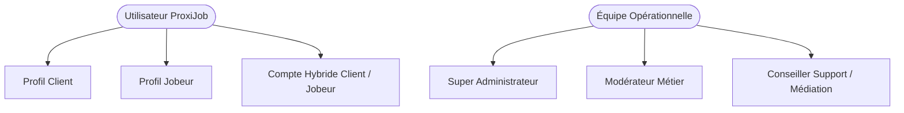
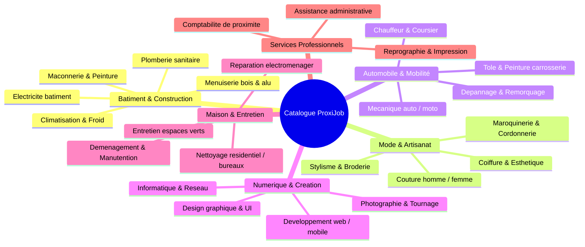
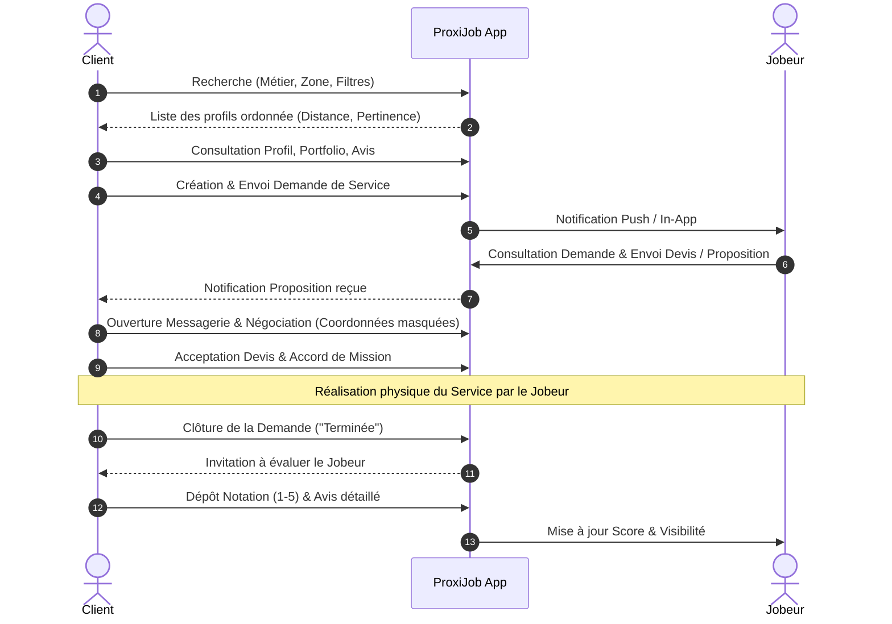
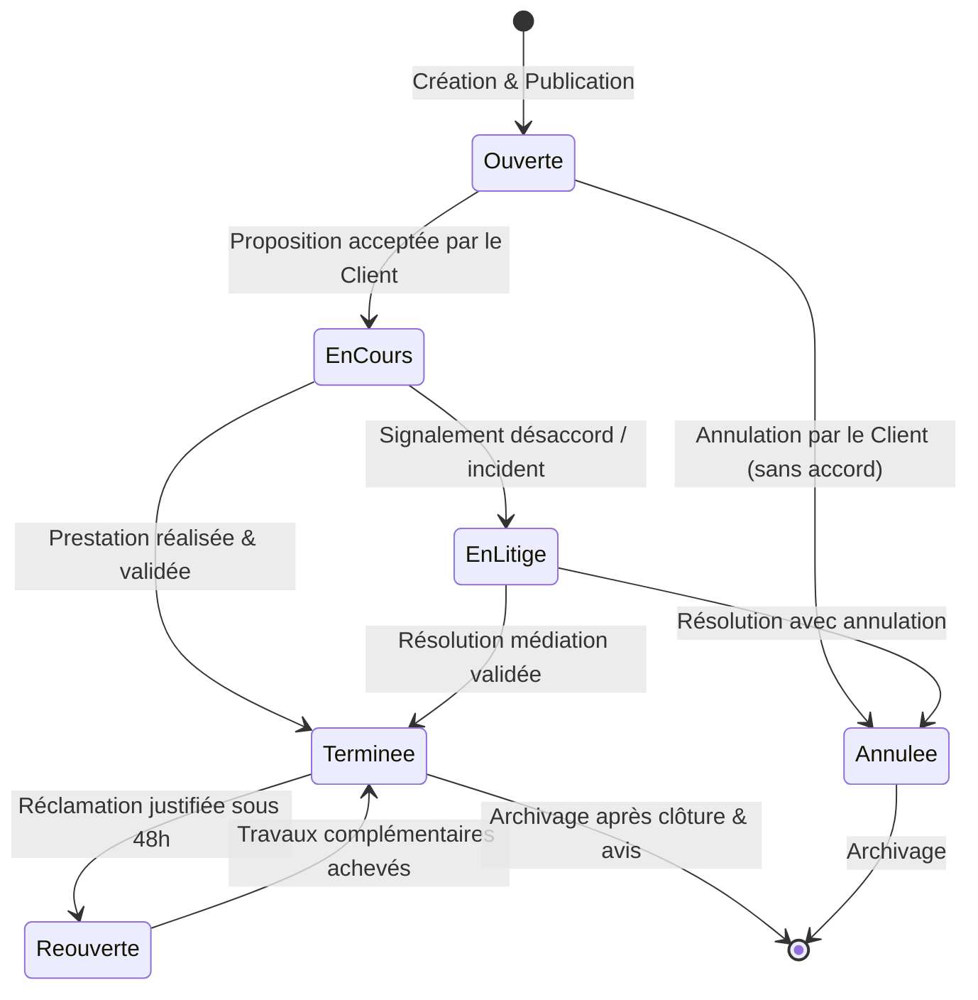
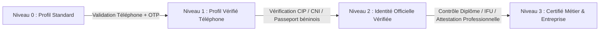
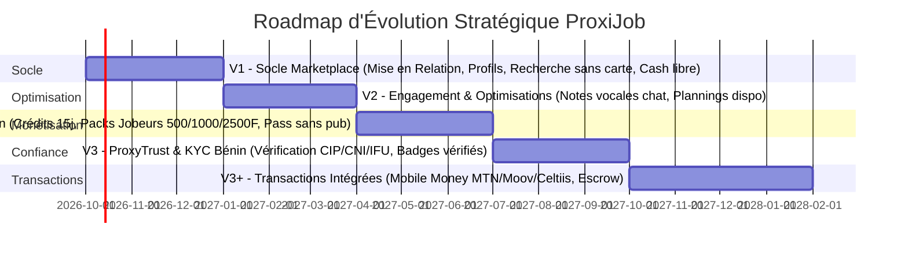
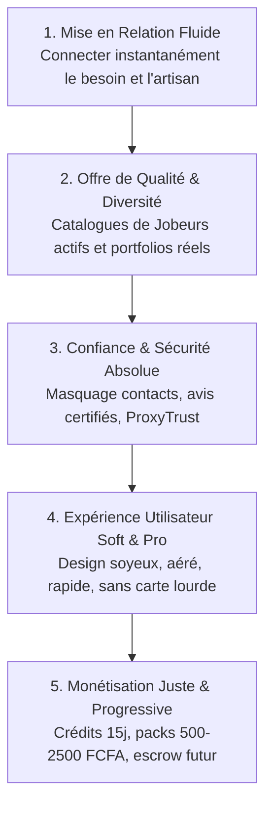

# CAHIER DES CHARGES FONCTIONNEL (CdCF) — PROXIJOB

---

**Projet :** Plateforme PROXIJOB  
**Rôle :** Lead Business Analyst & Product Owner Senior  
**Version du document :** 1.0.0 — Baseline de Spécification Contractuelle  
**Statut :** Validé / Document de Référence Métier  
**Périmètre :** Socle Fonctionnel Global (V1 à V3+) — Focus d'implémentation V1  
**Date :** Octobre 2026  

---

## SOMMAIRE EXÉCUTIF

1. [PRÉSENTATION GÉNÉRALE ET VISION STRATÉGIQUE (SECTION 1)](#1-présentation-générale-et-vision-stratégique)
   - 1.1 Contexte et Genèse du Projet
   - 1.2 Problématiques Ciblées
   - 1.3 Vision Produit et Proposition de Valeur
   - 1.4 Valeurs Fondamentales et Piliers du Système
2. [ÉCOSYSTÈME, MARCHÉ CIBLE ET ACTEURS (SECTION 2)](#2-écosystème-marché-cible-et-acteurs)
   - 2.1 Marché Territorial Initial et Expansion
   - 2.2 Typologie des Acteurs et Profils Utilisateurs
   - 2.3 Matrice Rôles & Permissions (RBAC)
   - 2.4 Typologie Hybride (Client ↔ Jobeur)
3. [RÉFÉRENTIEL DES MÉTIERS ET ARBORESCENCE DE SERVICES (SECTION 3)](#3-référentiel-des-métiers-et-arborescence-de-services)
   - 3.1 Structure du Catalogue de Services
   - 3.2 Taxonomie Initiale des Catégories et Sous-Services
   - 3.3 Évolutivité du Modèle Métier
4. [PARCOURS UTILISATEURS DÉTAILLÉS (USER JOURNEYS) (SECTION 2 & 3)](#4-parcours-utilisateurs-détaillés-user-journeys)
   - 4.1 Parcours Utilisateur Client
   - 4.2 Parcours Prestataire (Jobeur)
   - 4.3 Parcours Mixte / Compte Hybride
   - 4.4 Parcours Administrateur & Modérateur
5. [SPÉCIFICATIONS FONCTIONNELLES DÉTAILLÉES PAR MODULE (SECTIONS 3 À 10)](#5-spécifications-fonctionnelles-détaillées-par-module)
   - Module 01 : Inscription, Authentification & Gestion de Compte (Section 4)
   - Module 02 : Profils Utilisateurs & Portfolio Multimédia (Section 4)
   - Module 03 : Moteur de Recherche Intelligente & Localisation Sans Carte (Section 3)
   - Module 04 : Demandes de Service & Gestion du Cycle de Vie (Section 5)
   - Module 05 : Messagerie Intégrée, Négociation & Sécurisation des Coordonnées (Section 5)
   - Module 06 : Carnet de Favoris & Historique d'Activité (Section 6)
   - Module 07 : Confiance, Évaluations, Notations & Signalements (Section 7)
   - Module 08 : Dispositif de Confiance Avancée — ProxyTrust (Section 7)
   - Module 09 : Espace Administration & Back-Office Métier (Section 8)
   - Module 10 : Modèle Économique, Crédits, Packs & Monétisation (Section 9)
   - Module 11 : Transactions Financières, Mobile Money & Escrow (Section 10)
6. [IDENTITÉ VISUELLE, ERGONOMIE & DIRECTIVES UX/UI SOFT & CLEAN (SECTION 11)](#6-identité-visuelle-ergonomie--directives-uxui)
   - 6.1 Charte Graphique et Code Couleur (#1E40AF / #EAB308 / Blanc)
   - 6.2 Principes "Soft UI & Clean Design"
   - 6.3 Calibrage d'une Expérience Utilisateur Ultra Fluide et Professionnelle
7. [DÉCOUPAGE STRATÉGIQUE DES VERSIONS DU PRODUIT (SECTION 14)](#7-découpage-stratégique-des-versions-du-produit)
   - 7.1 V1 : Socle Marketplace (Sans carte, Cash libre)
   - 7.2 V2 : Engagement & Optimisations (Notes vocales, Planning)
   - 7.3 V2.5 : Monétisation, Crédits & Packs (Packs 500/1000/2500, Pass pub 100/300/500)
   - 7.4 V3 : Système ProxyTrust & Vérification Tiers (CIP/CNI)
   - 7.5 V3+ : Transactions Intégrées, Mobile Money & Séquestre
8. [EXIGENCES NON FONCTIONNELLES & GOUVERNANCE APDP (SECTION 13 & 15)](#8-exigences-non-fonctionnelles-nfr)
   - 8.1 Performance & Contraintes Réseau Mobile
   - 8.2 Sécurité Applicative & Protection des Comptes
   - 8.3 Confidentialité, Gouvernance APDP Bénin & Rétention des Données (Section 15)
   - 8.4 Disponibilité, Résilience & Sauvegardes
   - 8.5 Observabilité, Traçabilité & Auditabilité
9. [CADRE NORMATIF D'ANALYSE (RCAL)](#9-cadre-normatif-danalyse-rcal)
   - 9.1 Exigences Métier (Requirements)
   - 9.2 Contraintes Techniques et Réglementaires (Constraints)
   - 9.3 Hypothèses de Conception (Assumptions)
   - 9.4 Inconnues, Risques & Limites Identifiées
10. [STRATÉGIE D'ACQUISITION ET DÉPLOIEMENT TERRITORIAL (SECTION 12)](#10-stratégie-dacquisition-et-déploiement-territorial)
    - 10.1 Déploiement Géographique Progressif (Cotonou, Calavi, Porto-Novo)
    - 10.2 Acquisition Terrain & Onboarding des Jobeurs
    - 10.3 Acquisition Clients, Bouche-à-Oreille & Parrainage
11. [ARCHITECTURE TECHNIQUE, ÉVOLUTIVITÉ ET HAUTE DISPONIBILITÉ (SECTION 13)](#11-architecture-technique-évolutivité-et-haute-disponibilité)
    - 11.1 Architecture Applicative Découplée & API Modulaire
    - 11.2 Stratégie d'Évolutivité Horizontale & Gestion de Charge
    - 11.3 Résilience Réseau & Stratégie Low-Data Mobile
12. [PILOTAGE DE LA PERFORMANCE & TABLEAU DE BORD DES INDICATEURS (SECTION 16)](#12-pilotage-de-la-performance--tableau-de-bord-des-indicateurs)
    - 12.1 Indicateurs de Performance Côté Clients
    - 12.2 Indicateurs de Performance Côté Jobeurs
    - 12.3 Indicateurs Globaux Plateforme & Marché
13. [MAINTENANCE TECHNIQUE, SUPPORT UTILISATEUR & RÉSILIENCE (SECTION 17)](#13-maintenance-technique-support-utilisateur--résilience-opérationnelle)
    - 13.1 Typologies de Maintenance (Corrective, Préventive, Évolutive)
    - 13.2 Plan de Sauvegarde & Reprise d'Activité (PRA / PCA)
    - 13.3 Dispositif de Support Utilisateur & Assistance WhatsApp
14. [PRIORITÉS GÉNÉRALES & PHILOSOPHIE STRATÉGIQUE DU PROJET (SECTION 18)](#14-priorités-générales--philosophie-stratégique-du-projet)
    - 14.1 Les 5 Priorités Stratégiques Incompressibles
    - 14.2 Synthèse d'Alignement Décisionnel
15. [MATRICE DE TRAÇABILITÉ EXHAUSTIVE DES 18 SECTIONS DU DOCUMENT PROXIJOB](#15-matrice-de-traçabilité-exhaustive-des-18-sections-du-document-proxijob)

---

## 1. PRÉSENTATION GÉNÉRALE ET VISION STRATÉGIQUE

### 1.1 Contexte et Genèse du Projet
Dans l'environnement urbain et périurbain ouest-africain, et plus spécifiquement en République du Bénin, la contractualisation d'un service de proximité (bâtiment, dépannage, couture, mécanique, prestations intellectuelles ou numériques) s'effectue quasi exclusivement au travers de circuits informels :
* Le bouche-à-oreille et les recommandations de l'entourage immédiat ;
* Les groupes d'annonces non structurés sur WhatsApp et Facebook ;
* Les répertoires téléphoniques personnels fragmentés ;
* Des recherches aléatoires et non vérifiées sur les moteurs de recherche.

Ce modèle traditionnel engendre une forte asymétrie d'information, des délais importants de contractualisation, une incertitude critique sur la compétence réelle de l'artisan, et l'absence totale de traçabilité en cas de malfaçon ou de litige.

Parallèlement, un vivier massif d'artisans, d'indépendants, de micro-entrepreneurs et de professionnels qualifiés (désignés sous l'appellation générique de **Jobeurs**) souffre d'un manque d'outils numériques pour valoriser leurs réalisations concrètes, se démarquer par la qualité de leurs services, et développer une clientèle au-delà de leur périmètre géographique immédiat.

### 1.2 Problématiques Ciblées
| Axe | Problématique Client | Problématique Jobeur |
| :--- | :--- | :--- |
| **Visibilité & Découverte** | Incapacité d'identifier rapidement un prestataire disponible et compétent à proximité immédiate. | Dépendance totale au réseau informel ; aucune vitrine digitale pérenne pour exposer son travail. |
| **Confiance & Réputation** | Risque permanent sur la probité, le sérieux, les tarifs pratiqués et le respect des délais. | Absence d'historique certifié capitalisant sur ses réalisations réussies et avis clients. |
| **Efficacité & Échange** | Perte de temps en appels itératifs, négociations floues et descriptions approximatives du besoin. | Perte de temps face à des demandes mal cadrées ou hors de sa zone de déplacement. |
| **Transparence** | Absence de tarification de référence ou de portfolio visuel vérifiable. | Risque d'impayés, négociation sauvage à la baisse sans cadre protecteur. |

### 1.3 Vision Produit et Proposition de Valeur
**ProxiJob** a pour vocation de devenir l'infrastructure numérique de référence pour l'accès aux services de proximité en Afrique de l'Ouest, amorcée par le marché béninois.
La plateforme transforme une mise en relation informelle et chaotique en un parcours numérique sécurisé, fluide et transparent, couvrant l'intégralité du cycle de vie du besoin :
$$\text{Recherche} \longrightarrow \text{Sélection} \longrightarrow \text{Mise en Relation} \longrightarrow \text{Négociation} \longrightarrow \text{Réalisation} \longrightarrow \text{Clôture} \longrightarrow \text{Évaluation}$$

### 1.4 Valeurs Fondamentales et Piliers du Système
Le système repose sur quatre piliers cardinaux :
1. **Fiabilité :** Identification rigoureuse des prestataires, traçabilité des profils et modération active de la communauté.
2. **Proximité & Pertinence :** Valorisation des savoir-faire locaux grâce à un ciblage géographique par zone d'intervention et distance estimée.
3. **Transparence :** Présentation véridique des compétences, exposition de portfolios visuels réels et avis authentiques liés à des missions exécutées.
4. **Efficacité :** Démarche mobile-first axée sur l'utilité directe, limitant les frictions techniques et accélérant la prise de décision.

---

## 2. ÉCOSYSTÈME, MARCHÉ CIBLE ET ACTEURS

### 2.1 Marché Territorial Initial et Expansion
* **Territoire Initial Pilote :** République du Bénin.
* **Zone Prioritaire de Démarrage :** Agglomération du Grand Cotonou (Département du Littoral) et sa zone d'activité économique directe.
* **Extension Périurbaine Immédiate :** Abomey-Calavi (Département de l'Atlantique) et Porto-Novo / Sèmè-Kpodji (Département de l'Ouémé).
* **Stratégie Géographique :** Concentration hyper-locale afin d'atteindre une densité critique d'offre et de demande avant tout élargissement aux autres villes secondaires (Parakou, Bohicon, Ouidah, etc.) et à l'international.

### 2.2 Typologie des Acteurs et Profils Utilisateurs

1. **Le Client (Demandeur) :**
   * *Définition :* Particulier, foyer, artisan en sous-traitance ou entreprise cherchant à faire exécuter une tâche ponctuelle ou un projet récurrent.
   * *Attentes principales :* Découverte rapide d'un professionnel sérieux, réactivité des propositions, comparaison objective des portfolios, protection de sa vie privée.
2. **Le Jobeur (Prestataire) :**
   * *Définition :* Professionnel indépendant, artisan immatriculé, micro-entrepreneur, particulier exerçant une activité de service, ou entreprise de services constituée.
   * *Attentes principales :* Acquisition continue de chantiers / missions, visibilité professionnelle crédible, gestion simplifiée de son portefeuille et de sa disponibilité.
3. **L'Utilisateur Hybride :**
   * *Définition :* Utilisateur disposant d'un compte unique lui permettant de basculer instantanément d'une posture d'acheteur de services à une posture de prestataire sans rupture de session.
4. **L'Administrateur / Modérateur :**
   * *Définition :* Personnel interne de la plateforme en charge du respect des conditions générales, de l'arbitrage des litiges, de la validation des annonces et de la sécurité des utilisateurs.

### 2.3 Matrice Rôles & Permissions (RBAC)

| Fonctionnalité / Droit | Visiteur Non Connecté | Client Authentifié | Jobeur Authentifié | Modérateur | Super Admin |
| :--- | :---: | :---: | :---: | :---: | :---: |
| Parcourir l'annuaire & rechercher | Lecteur | Lecteur | Lecteur | Lecteur | Lecteur |
| Consulter les profils & portfolios | Lecteur | Lecteur | Lecteur | Lecteur | Lecteur |
| Publier une demande de service | Interdit | Créateur | Créateur | Interdit | Tout |
| Soumettre une proposition / devis | Interdit | Interdit | Créateur | Interdit | Tout |
| Échanger via messagerie interne | Interdit | Acteur | Acteur | Modérateur (Audit) | Tout |
| Publier un avis / note | Interdit | Auteur (si client) | Interdit | Modérateur | Tout |
| Définir zones & disponibilités | Interdit | Interdit | Gestionnaire | Interdit | Tout |
| Souscrire à un Pack / Crédits | Interdit | Interdit | Acheteur | Interdit | Tout |
| Modérer annonces et signalements | Interdit | Interdit | Interdit | Opérateur | Tout |
| Gérer les comptes & accès admin | Interdit | Interdit | Interdit | Interdit | Tout |

### 2.4 Typologie Hybride (Client ↔ Jobeur)
* Un utilisateur ProxiJob s'enregistre avec une identité racine unique (identifiant, mot de passe, contact).
* Un sélecteur d'espace ("Switcher") est accessible à tout moment dans l'en-tête ou le menu profil de l'application :
  * **Espace Client :** Accès aux recherches, favoris, demandes émises, devis reçus, avis déposés.
  * **Espace Jobeur :** Accès au tableau de bord d'activité, annonces de services, demandes reçues, gestion du portfolio, gestion des crédits et forfaits.
* Les données de profils sont hermétiques : les avis reçus en tant que Jobeur n'affectent pas le statut de l'utilisateur lorsqu'il opère en tant que Client, garantissant une étanchéité fonctionnelle absolue.

---

## 3. RÉFÉRENTIEL DES MÉTIERS ET ARBORESCENCE DE SERVICES

### 3.1 Structure du Catalogue de Services
Le catalogue est structuré en **2 niveaux hiérarchiques extensibles** :
* **Niveau 1 : Catégorie Métier Principale (Macro-domaine)**
* **Niveau 2 : Service Spécifique / Compétence Ciblée**

### 3.2 Taxonomie Initiale des Catégories et Sous-Services

### 3.3 Évolutivité du Modèle Métier
* L'architecture de la base de données doit implémenter un modèle polymorphique ou relationnel normalisé (`Category` parent-enfant) permettant aux administrateurs d'injecter de nouvelles catégories, d'activer/désactiver des sous-services ou de fusionner des rubriques sans aucune altération de code ni interruption de service.

---

## 4. PARCOURS UTILISATEURS DÉTAILLÉS (USER JOURNEYS)

### 4.1 Parcours Utilisateur Client

### 4.2 Parcours Prestataire (Jobeur)
1. **Création & Qualification :** Inscription, déclaration de l'activité principale, sélection des services spécifiques, choix du statut (Particulier vs Entreprise/Raison sociale).
2. **Configuration de l'Offre :** Renseignement des compétences, définition de la zone d'intervention (sélection des quartiers/communes de desserte), indication des plages de disponibilité.
3. **Mise en Scène du Savoir-Faire :** Téléversement des photos/vidéos de réalisations dans le Portfolio (cas avant/après, chantiers livrés).
4. **Réception d'Opportunités :** Consultation du flux de demandes locales, réception des alertes prioritaires (demandes urgentes).
5. **Réponse & Devis :** Élaboration d'une proposition technique et tarifaire adaptée au besoin exprimé.
6. **Exécution & Suivi :** Communication via la messagerie intégrée, confirmation de l'avancement.
7. **Consolidation de Réputation :** Clôture de la prestation, capitalisation sur l'évaluation reçue, alimentation des métriques du profil.

### 4.3 Parcours Mixte / Compte Hybride
* Basculement fluide entre la vue Client et la vue Jobeur via le commutateur de contexte.
* Mutualisation des alertes système dans un centre de notification unifié, avec un étiquetage explicite de la posture concernée (Ex : `[Jobeur] Nouvelle demande reçue` ou `[Client] Le Jobeur X a répondu à votre devis`).

### 4.4 Parcours Administrateur & Modérateur
1. **Supervision :** Tableau de bord de l'activité en temps réel (demandes créées, profils actifs, transactions).
2. **Modération des Inscriptions & Profils :** Vérification de la conformité des descriptions et portfolios par rapport aux standards de la communauté.
3. **Traitement des Signalements :** File de tickets priorisés (fraude suspectée, harcèlement, contenu illicite, faux profils).
4. **Médiation & Litiges :** Prise en main des contestations de prestations, examen des échanges en messagerie, décision d'arbitrage.

---

## 5. SPÉCIFICATIONS FONCTIONNELLES DÉTAILLÉES PAR MODULE

---

### MODULE 01 : INSCRIPTION, AUTHENTIFICATION & GESTION DE COMPTE

#### SF-01.1 : Enregistrement de Nouveau Compte
* **Description :** Le système permet à tout utilisateur d'initier une inscription en tant que Client ou Jobeur.
* **Champs Obligatoires :**
  * Nom et Prénom ;
  * Numéro de téléphone mobile (format national Bénin : +229 suivi de 8 ou 10 chiffres selon les normes de l'ARCEP) ;
  * Adresse email valide (optionnelle au départ si numéro mobile validé, mais recommandée) ;
  * Mot de passe robuste (minimum 8 caractères, au moins une majuscule, un chiffre, un caractère spécial).
* **Règles Métier :**
  * Unicité absolue du numéro de téléphone et de l'adresse email dans la base utilisateurs.
  * Validation d'acceptation obligatoire des Conditions Générales d'Utilisation (CGU) et de la Politique de Confidentialité.

#### SF-01.2 : Authentification & Sécurité des Sessions
* **Description :** Connexion sécurisée par identifiant unique (téléphone ou email) et mot de passe.
* **Sécurité :**
  * Génération de jetons de session chiffrés (JWT ou sessions serveur sécurisées avec attributs HttpOnly, Secure, SameSite).
  * Temporisation et verrouillage automatique de compte après 5 tentatives consécutives échouées (Rate Limiting IP et compte).
  * Option de déconnexion globale terminant immédiatement toutes les sessions actives.

#### SF-01.3 : Récupération de Compte et Mot de Passe Oublié
* **Description :** Réinitialisation sécurisée par canal alternatif vérifié (envoi d'un code OTP à usage unique par SMS ou lien de réinitialisation sécurisé par email d'une validité maximale de 15 minutes).

---

### MODULE 02 : PROFILS UTILISATEURS & PORTFOLIO MULTIMÉDIA

#### SF-02.1 : Profil Client
* Informations personnelles modifiables (Nom, prénom, photo d'avatar, ville/quartier de résidence, téléphone de contact).
* Tableau de bord Client centralisé :
  * Demandes en cours, en attente de propositions, terminées ;
  * Historique des commandes de services ;
  * Liste des Jobeurs enregistrés en favoris ;
  * Journal des avis émis.

#### SF-02.2 : Profil Professionnel Jobeur
* **Champs Métier Spécifiques :**
  * Statut juridique : Déclaration obligatoire entre **Particulier / Artisan indépendant** ou **Entreprise / Société** (avec saisie de la raison sociale et éventuel numéro IFU / RCCM) ;
  * Activité principale (sélection unique) et Activités secondaires (sélection multiple) ;
  * Descriptif de présentation professionnelle (bio, années d'expérience, méthode de travail) ;
  * Zone d'intervention géographique déclarée (sélection par localités, villes et quartiers couverts) ;
  * Grille de disponibilité horaire et hebdomadaire (Ex : Du Lundi au Samedi, 8h-18h, Disponible les jours fériés, etc.) ;
  * Statut opérationnel immédiat : `Disponible`, `Occupé`, `En congé`.

#### SF-02.3 : Portfolio Multimédia du Jobeur
* **Objectif :** Vitrine probatoire du savoir-faire artisanal.
* **Spécifications :**
  * Capacité d'ajouter des projets illustrés (Titre, catégorie, description de la réalisation) ;
  * Prise en charge des photographies haute définition (avec compression automatique côté serveur au format WebP) ;
  * Fonctionnalité spécifique de comparaison visuelle **"Avant / Après"** (deux images appairées, particulièrement adaptées aux métiers de la rénovation, carrosserie, coiffure, plomberie) ;
  * Affichage des distinctions, diplômes ou certifications professionnelles déclarées.

---

### MODULE 03 : MOTEUR DE RECHERCHE INTELLIGENTE & GÉOLOCALISATION

#### SF-03.1 : Stratégie de Géolocalisation SANS Carte Interactive en V1
* **Décision d'Architecture Contractuelle (V1) :** Conformément au cadrage officiel, **aucun affichage de carte interactive de type Google Maps / Leaflet n'est déployé en interface en V1**.
* **Motifs Métier :** Économie de bande passante mobile sur les réseaux locaux, réduction de la charge cognitive, simplification de l'UX mobile, orientation vers la pertinence directe du résultat.
* **Mécanismes Alternatifs de Compensation de Proximité :**
  1. **Rayon de recherche dynamique ajustable :** Curseur paramétrable par l'utilisateur (Ex : 2 km, 5 km, 10 km, 25 km, Tout le département).
  2. **Distance estimée calculée :** Calcul en arrière-plan (formule de Haversine ou indexation spatiale PostGIS) entre le barycentre de localisation du Client et celui du Jobeur, affiché sous forme textuelle : *"À ~2,4 km de vous"*.
  3. **Zone d'intervention déclarée :** Filtrage algorithmique strict confrontant le quartier du Client à la liste des quartiers desservis déclarés par le Jobeur.

#### SF-03.2 : Filtres de Recherche et Critères de Sélection
* Filtrage multicritère combinatoire :
  * Par Catégorie Métier et Service Spécifique ;
  * Par Localité / Commune / Quartier (Ex : Cotonou - Akpakpa, Cadjehoun, Haie Vive, Calavi - Arconville, etc.) ;
  * Par Disponibilité temporelle (immédiate, jours de semaine, week-end) ;
  * Par Évaluation minimale (Ex : 4 étoiles et plus) ;
  * Par Statut de confiance (Jobeurs vérifiés ProxyTrust en V3).

#### SF-03.3 : Algorithme de Tri et Classement des Résultats
* Tri paramétrable par l'utilisateur :
  * **Par Pertinence (Défaut) :** Pondération combinant la proximité géographique, le score d'évaluation moyen, le nombre d'avis récents et le taux de réponse du Jobeur ;
  * **Par Proximité :** Ordonnancement strictly ascendant de la distance estimée ;
  * **Par Note des Avis :** Ordonnancement par score décroissant.
* **Principe d'Équité Métier :** Les options payantes de mise en avant (Boost) doivent faire l'objet d'un bandeau "Sponsorisé" explicite et ne doivent jamais altérer artificiellement les notes réelles du prestataire.

---

### MODULE 04 : DEMANDES DE SERVICE & GESTION DU CYCLE DE VIE

#### SF-04.1 : Création et Structuration de la Demande
* Le Client formalise son besoin via un formulaire guidé :
  * Titre synthétique du besoin ;
  * Catégorie et sous-service ciblés ;
  * Description narrative détaillée des travaux à accomplir ;
  * Localisation exacte de la prestation (quartier, repères visuels locaux) ;
  * Date et plage horaire souhaitées d'intervention ;
  * Degré d'urgence : `Normal` ou `Urgent (Intervention rapide demandée)` ;
  * Pièces jointes visuelles (jusqu'à 5 photographies ou documents d'illustration).

#### SF-04.2 : Machine à États du Cycle de Vie d'une Demande

* **Détail des Statuts Normatifs :**
  1. `Ouverte` : Demande visible par le/les Jobeurs ciblés, en attente de propositions.
  2. `En cours` : Un accord est intervenu entre le Client et un Jobeur spécifique sur une proposition tarifaire/technique.
  3. `Terminée` : Le Jobeur a livré la prestation et le Client confirme son achèvement.
  4. `En litige` : Blocage signalé par l'une des parties requérant l'intervention de la modération.
  5. `Réouverte` : Prestation nécessitant une correction immédiate validée avant clôture définitive.
  6. `Annulée` : Demande abandonnée avant contractualisation ou suite à un arbitrage.

#### SF-04.3 : Module Spécifique "Demandes Urgentes"
* Activation d'un flag visuel proéminent (badge rouge d'urgence).
* Notification instantanée (Push prioritaire / SMS) auprès des Jobeurs actifs et déclarés disponibles immédiatement dans le périmètre local.
* Engagement clair de la plateforme : ProxiJob garantit la priorisation de la diffusion, mais ne formule pas de promesse contractuelle de délai d'intervention physique garanti.

---

### MODULE 05 : MESSAGERIE INTÉGRÉE, NÉGOCIATION & SÉCURISATION

#### SF-05.1 : Chat Intégré Temps Réel
* Messagerie bidirectionnelle instantanée contextualisée à une demande de service donnée.
* Possibilité d'échange de messages textes, de documents PDF et de photographies de chantiers.
* Accusés de réception et d'état de lecture (*Envoyé*, *Délivré*, *Lu*).

#### SF-05.2 : Masquage Automatique des Coordonnées (Anti-Désintermédiation Précoce)
* **Règle Métier Contractuelle :** Afin de garantir la traçabilité des échanges, d'éviter les fraudes en amont et de préserver le modèle économique de la plateforme, **les numéros de téléphone, adresses électroniques, liens externes et coordonnées bancaires sont masqués ou filtrés automatiquement dans le chat avant acceptation formelle d'une proposition**.
* **Implémentation Algorithmique :** Regex d'analyse syntaxique bloquant les formats téléphoniques béninois (ex : suites de 8 ou 10 chiffres), les adresses mails, les liens WhatsApp directs (`wa.me`).
* **Déblocage :** Dès lors que le Client clique sur *"Accepter la proposition"* (contractualisation mutuelle de la demande), les coordonnées de contact direct sont dévoilées aux deux parties pour coordonner le rendez-vous physique.

---

### MODULE 06 : CARNET DE FAVORIS & HISTORIQUE D'ACTIVITÉ

#### SF-06.1 : Gestion des Favoris
* Capacité pour le Client d'épingler un Jobeur dans son carnet personnel en 1 clic.
* Organisation en listes ou accès rapide pour relancer des commandes récurrentes auprès d'artisans de confiance sans refaire une recherche générale.

#### SF-06.2 : Historique Transparent et Traçable
* **Vue Client :** Registre chronologique exhaustif de toutes les demandes émises, devis reçus, prestataires sollicités, dates et états de clôture.
* **Vue Jobeur :** Tableau de bord de l'historique d'activité servant de livre de bord professionnel (missions effectuées, clients servis, évaluations reçues, taux de conversion des propositions).

---

### MODULE 07 : CONFIANCE, ÉVALUATIONS, NOTATIONS & SIGNALEMENTS

#### SF-07.1 : Système d'Avis et d'Évaluation Certifiée
* **Condition d'Éligibilité Stricte :** Seul un Client ayant mené à son terme une demande de service (statut `Terminée`) avec un Jobeur spécifique est autorisé à soumettre un avis. Aucun avis spontané non lié à une mission n'est accepté.
* **Composantes de la Note :**
  * Note globale sur une échelle de 1 à 5 étoiles ;
  * Critères qualitatifs détaillés : Qualité du travail, Respect des délais, Amabilité/Communication, Propreté/Finition ;
  * Commentaire textuel argumenté.
* **Droit de Réponse :** Le Jobeur dispose d'un droit de réponse unique, public et modéré pour apporter un éclairage courtois à un avis défavorable.

#### SF-07.2 : Dispositif Anti-Fraude et Anti-Représailles
* Algorithme de détection des avis de complaisance (croisement des adresses IP, détection de comptes créés à la même date).
* Période de grâce et modération des avis négatifs manifestement diffamatoires ou ne respectant pas les règles d'éthique de la communauté.

#### SF-07.3 : Système Global de Signalement
* Tout utilisateur peut déclencher un signalement sur :
  * Un profil utilisateur (fausse identité, informations trompeuses) ;
  * Un contenu / média (photo inappropriée, contrefaçon de portfolio) ;
  * Une demande de service frauduleuse ou suspecte ;
  * Une tentative d'escroquerie ou de chantage ;
  * Un comportement agressif ou harcèlement via messagerie.
* Traitement obligatoire sous SLA modérateur avec possibilité de sanctions graduées : avertissement formel, suspension temporaire, radiation définitive avec blocage du numéro IMEI/téléphone.

---

### MODULE 08 : DISPOSITIF DE CONFIANCE AVANCÉE — PROXYTRUST (V3)

#### SF-08.1 : Paliers de Confiance et Niveaux de Vérification
Le programme **ProxyTrust** introduit une certification à plusieurs échelons adaptée au cadre législatif et sociétal béninois :

* **Niveau 1 (Standard) :** Validation cryptographique du numéro de mobile et de l'email.
* **Niveau 2 (ProxyTrust Identité) :** Téléversement et contrôle du Certificat d'Identification Personnelle (CIP) ou de la Carte Nationale d'Identité Biométrique béninoise.
* **Niveau 3 (ProxyTrust Expert / Pro) :** Contrôle des qualifications professionnelles (diplôme d'artisan, immatriculation au Registre de Commerce / IFU, références vérifiées).

#### SF-08.2 : Valorisation Visuelle et Impact Algorithmique
* Attribution d'un badge distinctif et inaltérable **ProxyTrust** sur le profil.
* Bonus de pondération dans l'algorithme de tri lors des recherches par pertinence.
* Taux de conversion significativement accru auprès des Clients en quête de sérénité.

---

### MODULE 09 : ESPACE ADMINISTRATION & BACK-OFFICE MÉTIER

#### SF-09.1 : Tableau de Bord Statistique et Pilotage
* Vue d'ensemble des KPI en temps réel :
  * Nouveaux inscrits (Clients / Jobeurs) ;
  * Volume quotidien de recherches et ventilation par catégories ;
  * Nombre de demandes créées, en cours, terminées ;
  * Taux de conversion de la messagerie ;
  * Temps moyen de première réponse d'un Jobeur.

#### SF-09.2 : Gestion des Utilisateurs et Droits
* Recherche avancée d'utilisateurs par nom, téléphone, statut, rôle.
* Fiche utilisateur consolidée (historique des demandes, signalements associés, avis reçus).
* Actions d'administration : Réinitialisation de mot de passe, suspension temporaire, bannissement définitif, vérification manuelle de profil.

#### SF-09.3 : Modération des Contenus et Portfolios
* File d'attente de modération des nouvelles images de portfolio et annonces de services.
* Outil de validation / rejet avec notification du motif au Jobeur (ex : *"Image non conforme ou floue"*).

#### SF-09.4 : Console de Gestion des Litiges et Signalements
* File priorisée de tickets de litiges.
* Interface d'audit des conversations de messagerie liées au litige (respectant les protocoles d'habilitation stricte).
* Clôture administrative de litige avec décision d'arbitrage notifiée aux parties.

---

### MODULE 10 : MODÈLE ÉCONOMIQUE, CRÉDITS, PACKS & MONÉTISATION

#### SF-10.1 : Philosophie du Modèle Hybride et Gratuité de Base
* **Socle Gratuit Garanti :** La création de compte, la recherche de Jobeurs et la publication de demandes par les Clients demeurent 100% gratuites afin de lever toute barrière à l'adoption.
* Pour les Jobeurs, un quota d'annonces gratuites d'amorçage est octroyé à l'inscription pour tester la valeur de la plateforme sans barrière financière.

#### SF-10.2 : Système de Crédits de Publication de Services
* **Règle Fondamentale :** Un crédit de publication donne droit à l'activation d'une annonce de service pour une **durée déterminée de 15 jours consécutifs**.
* **Consommation de Crédit :**
  * Nouvelle publication de service : 1 crédit.
  * Renouvellement d'une annonce expirée : 1 crédit.
  * Modification d'une annonce active : Gratuit.
  * Suppression d'une annonce : Gratuit.
  * Réactivation d'une annonce archivée : 1 crédit.

#### SF-10.3 : Grille Tarifaire des Packs Commerciaux Jobeurs
Afin d'accompagner l'artisan local selon sa taille économique, 3 offres packagées sont formalisées :

| Nom de l'Offre | Volume de Crédits | Options Visibilité Incluses | Validité / Avantage | Tarif Forfaitaire (FCFA) |
| :--- | :---: | :--- | :--- | :---: |
| **Pack Démarrage** | 10 crédits | Boost de profil pendant 24 heures | Badge temporaire « Nouveau Jobeur » | **500 FCFA** |
| **Pack Visibilité** | 20 crédits | Boost de profil pendant 3 jours | Mise en avant en tête de catégorie | **1 000 FCFA** |
| **Pack Vidéo** | 30 crédits | Diffusion vidéo promotionnelle | 7 jours de visibilité renforcée | **2 500 FCFA** |

#### SF-10.4 : Pass "Sans Publicité" (Clients & Utilisateurs Fréquents)
Pour naviguer sans encarts publicitaires, des pass temporels sans engagement sont souscriptibles :
* **Pass 7 jours :** 100 FCFA
* **Pass 30 jours :** 300 FCFA
* **Pass 90 jours :** 500 FCFA

#### SF-10.5 : Régie Publicitaire & Sponsoring Entreprises
* **Formats Autorisés :** Bannières natives non intrusives, vidéos courtes de savoir-faire métier.
* **Sponsoring Thématique :** Parrainage exclusif d'une catégorie par une marque partenaire du secteur (Ex : *"Catégorie Plomberie — sponsorisée par une marque de tuyauterie/outillage locale"*).
* **Règle Déontologique :** Aucune sponsorisation d'entreprise ne peut altérer l'ordre naturel des avis ou le score de réputation d'un Jobeur.

---

### MODULE 11 : TRANSACTIONS FINANCIÈRES, MOBILE MONEY & ESCROW (V3+)

#### SF-11.1 : Roadmap et Découplage Initial (V1)
* **Périmètre V1 :** **Zéro flux financier direct sur la plateforme**. Les tarifs se négocient entre le Client et le Jobeur via la messagerie/devis, et le règlement physique s'effectue hors plateforme de gré à gré (espèces ou Mobile Money direct).
* **Périmètre Cible (V3+) :** Intégration des passerelles Mobile Money souveraines au Bénin :
  * **MTN Mobile Money Bénin (MoMo)** ;
  * **Moov Money Bénin** ;
  * **Celtiis Cash / Money**.

#### SF-11.2 : Mécanisme de Compte Séquestre (Escrow / Tiers de Confiance)
* Le Client approvisionne le montant de la mission validée sur un compte séquestre ProxiJob au moment de l'accord.
* Les fonds sont bloqués et garantis.
* À la fin des travaux, le Client confirme la conformité : les fonds sont débloqués et crédités sur le portefeuille numérique du Jobeur (déduction faite de la commission de service éventuelle de la plateforme).
* En cas de litige, les fonds demeurent gelés jusqu'à résolution formelle par l'équipe de médiation.

---

## 6. IDENTITÉ VISUELLE, ERGONOMIE & DIRECTIVES UX/UI SOFT & CLEAN (SECTION 11)

### 6.1 Charte Graphique et Code Couleur Normatif
L'univers graphique de ProxiJob traduit une alliance subtile entre la réassurance institutionnelle et le dynamisme du travail bien fait, sous un prisme résolument moderne, accessible et doux :
* **Bleu Royal Confiance (`#1E40AF` / Univers Client) :** Évoque la rigueur professionnelle, l'intégrité, la stabilité et la sérénité du demandeur de service. Nuance d'en-tête `#0F2F4E` et surface douce `#EFF6FF`.
* **Jaune-Ambre Chaleureux & Soft (`#EAB308` / Univers Jobeur) :** Symbolise l'action, l'énergie artisanale et la mise en valeur des compétences locales. Cette nuance est expressément adoucie pour bannir tout jaune fluo agressif, et complétée par un texte ambre contrasté accessible `#854D0E` (conforme WCAG AA) et des surfaces douces `#FEF9C3` / `#FFFBEB`.
* **Surfaces Douces & Blanc Lisibilité :** Cartes et éléments interactifs en blanc pur (`#FFFFFF`), reposant sur un fond d'écran reposant `slate-50` (`#F8FAFC`) ou `zinc-50` (`#FAFAFA`), délimités par des bordures ultra fines de 1px en `slate-200` (`#E2E8F0`).

### 6.2 Principes Directeurs "Soft UI & Clean Design"
1. **Respiration Visuelle ("Soft Whitespace") :** Espacements généreux et aérés (`p-5` à `p-6`, `gap-6`), éliminant tout effet de saturation informationnelle sur petit écran.
2. **Ombres Subtiles Veloutées ("Soft Shadows") :** Rejet des ombres portées noires et dures. Emploi d'ombres diffuses légères (`shadow-soft : 0 1px 3px rgba(15, 23, 42, 0.04)`).
3. **Zéro Carte Interactive en V1 :** Remplacement par un moteur de proximité textuel (Villes, Arrondissements, Quartiers, distance estimée textuelle en km et repères réels de proximité).
4. **Trust-Based Interface :** Visibilité immédiate des gages de confiance (badges ProxyTrust en V3, volume d'avis vérifiés, portfolios certifiés).

### 6.3 Calibrage d'une Expérience Utilisateur Ultra Fluide et Professionnelle
1. **Parcours Sans Friction :** Hiérarchie claire à une seule action prioritaire par écran (Primary CTA).
2. **Transitions Fluides (150-200ms ease-out) :** Toutes les micro-interactions (survol, ouverture de drawer, affichage de modales, bascule d'onglets) sont animées avec douceur sans ralentir l'exécution.
3. **Micro-Interactions Douces :** Rétroaction tactile subtile (`active:scale-[0.98]`), focus ring délicat, formulaires aérés avec validation progressive en temps réel.
4. **Feedbacks Clairs & Bienveillants :** Notifications Toast douces, formulaires tolérants aux erreurs de saisie avec messages d'aide constructifs et guidage bienveillant.

---

## 7. DÉCOUPAGE STRATÉGIQUE DES VERSIONS DU PRODUIT (SECTION 14)

### 7.1 V1 : Socle Marketplace
* Création et authentification des comptes Client, Jobeur et Hybride (bascule 1-clic sans déconnexion).
* Profils complets des Jobeurs avec statut (Particulier / Entreprise), compétences et portfolio photos avec comparateur "Avant / Après".
* Moteur de recherche multicritère par métier, ville, quartier et rayon ajustable (**sans carte interactive**).
* Gestion complète des demandes de service (formulaire wizard 4 étapes, publication, cycle de vie contrôlé).
* Messagerie instantanée intégrée avec **masquage automatique algorithmique des coordonnées** avant acceptation contractuelle d'une proposition.
* Carnet de favoris et historique d'activité.
* Système d'avis et notations (accessible **exclusivement après clôture de mission**) et signalement d'abus.
* Back-office d'administration et de modération de base.
* **Modèle financier V1 : Paiement cash de gré à gré libre (zéro flux financier en ligne en V1).**

### 7.2 V2 : Engagement & Optimisations
* Amélioration de l'UX/UI sur la base des métriques d'usage réelles recueillies en V1.
* Gestion enrichie du planning et de l'affichage de disponibilité en temps réel pour les Jobeurs.
* Extension de la messagerie : envoi de messages vocaux légers (facilitant les échanges pour les artisans peu à l'aise à l'écrit) et réponses rapides.
* Moteur de recherche enrichi avec suggestions intelligentes et autocomplétion des métiers.
* Module de notification push enrichi.

### 7.3 V2.5 : Monétisation, Crédits & Packs
* Déploiement du modèle économique payant pour les Jobeurs :
  * Consommation de crédits de publication (durée d'activation de 15 jours par annonce) ;
  * Packs commerciaux forfaitaires :
    * **Pack Démarrage :** 10 crédits + Boost 24h + Badge Nouveau Jobeur = **500 FCFA** ;
    * **Pack Visibilité :** 20 crédits + Boost 3j + Tête de catégorie = **1 000 FCFA** ;
    * **Pack Vidéo :** 30 crédits + Vidéo promotionnelle + 7j visibilité = **2 500 FCFA** ;
  * Boosts temporaires de profils et d'annonces.
* Pass "Sans Publicité" ponctuels pour les utilisateurs :
  * **Pass 7 jours :** 100 FCFA ;
  * **Pass 30 jours :** 300 FCFA ;
  * **Pass 90 jours :** 500 FCFA.
* Régie publicitaire (bannières AdMob / partenaires locaux) et sponsoring exclusif de catégories de services par des marques.

### 7.4 V3 : Système ProxyTrust & Vérification Tiers
* Lancement du label de confiance officiel **ProxyTrust**.
* Procédures d'authentification d'identité adaptées au Bénin (vérification CIP / CNI / IFU / Passeport).
* Vérification des diplômes artisanaux et immatriculations d'entreprises avec des organismes partenaires locaux.
* Surclassement algorithmique des profils certifiés ProxyTrust dans les résultats de recherche.
* Modèles de contrats de prestation types et module de médiation des litiges.

### 7.5 V3+ : Transactions Intégrées, Mobile Money & Séquestre
* Intégration des API Mobile Money béninoises : **MTN Mobile Money (MoMo)**, **Moov Money Bénin**, **Celtiis Cash**.
* Déploiement du portefeuille numérique utilisateur (Wallet in-app).
* Mécanisme de séquestre financier (Escrow) : consignation des fonds à l'acceptation du devis, libération au Jobeur à la validation client post-prestation.
* Module de médiation financière en cas de contestation.
* Génération automatique de reçus et factures dématérialisées conformes.

---

## 8. EXIGENCES NON FONCTIONNELLES & GOUVERNANCE APDP (SECTION 13 & 15)

### 8.1 Performance & Contraintes Réseau Mobile
* **Taille des bundles applicatifs :** Le poids initial transféré de la web-app ne doit pas excéder 1,5 Mo afin de garantir un affichage quasi instantané sur réseau mobile 3G/4G local.
* **Optimisation des Médias :** Compression automatique côté serveur de toutes les photos téléversées dans les portfolios (dimensionnement maximal 1200px, format moderne WebP, poids unitaire inférieur à 150 Ko).
* **Temps de Réponse API :** 95% des requêtes de recherche et consultation doivent répondre en moins de 350 ms sous charge nominale.

### 8.2 Sécurité Applicative & Protection des Comptes
* Chiffrement systématique de l'ensemble des communications réseau via le protocole TLS 1.3 (HTTPS / WSS).
* Hachage cryptographique robuste des mots de passe en base de données avec l'algorithme Argon2id ou Bcrypt (facteur de coût $\ge 12$).
* Protection contre les vulnérabilités standards du Top 10 OWASP (failles XSS, injections SQL, détournement de clics / Clickjacking, falsification de requêtes intersites / CSRF).
* Limitation stricte du débit des requêtes (Rate Limiting) sur les endpoints sensibles (authentification, création de demandes, envoi d'OTP).

### 8.3 Confidentialité, Gouvernance APDP Bénin & Rétention des Données (Section 15)
* **Conformité Réglementaire Locale :** Alignement strict sur les dispositions de la **Loi N° 2017-20 portant Code du Numérique en République du Bénin** et les directives de l'**APDP (Autorité de Protection des Données Personnelles)**.
* **Gestion des Données Personnelles :** Données d'identité (nom, prénom, numéro de téléphone, email, pièces justificatives CIP/CNI) chiffrées au repos (AES-256) et accessibles uniquement selon habilitation stricte.
* **Masquage Préventif :** Règle de non-divulgation des coordonnées téléphoniques dans la messagerie avant la formalisation de la mission, protégeant la vie privée et prévenant le harcèlement.
* **Droits des Personnes :** Droit d'accès, de rectification, d'opposition et d'effacement garanti pour tout utilisateur sur simple demande ou depuis son interface de gestion de compte.
* **Rétention des Données :** Conservation des données d'historique de missions et de messagerie pendant 2 ans à des fins probatoires en cas de litige, suivie d'une anonymisation irréversible.

### 8.4 Disponibilité, Résilience & Sauvegardes
* Objectif de disponibilité globale de la plateforme de **99,8%** hors plages de maintenance programmées.
* Stratégie de sauvegarde continue de la base de données avec clichés quotidiens immuables (snapshots) répliqués sur un site géographique distant.
* Procédure de reprise après sinistre (Disaster Recovery Plan) garantissant un RPO (Perte de données maximale admissible) $\le 1\text{ heure}$ et un RTO (Temps de rétablissement maximal) $\le 4\text{ heures}$.

### 8.5 Observabilité, Traçabilité & Auditabilité
* Journalisation centralisée des événements de sécurité et d'administration (création de compte, modifications de statut, accès modérateurs).
* Traçabilité immuable des actions de modération (horodatage, identifiant du modérateur, motif de sanction).
* Tableau de bord de surveillance technique (monitoring de charge CPU, mémoire, latence API, taux d'erreurs HTTP 5xx).

---

## 9. CADRE NORMATIF D'ANALYSE (RCAL)

Pour assurer une rigueur d'ingénierie logicielle absolue, toutes les spécifications du projet sont classées selon les 4 catégories normatives :

### 9.1 Exigences Métier (Requirements)
* [REQ-01] La plateforme doit permettre l'inscription et la connexion autonome de profils Clients et Jobeurs, avec prise en charge native du compte hybride en 1 clic.
* [REQ-02] Le moteur de recherche doit proposer des résultats filtrés par métier, commune, quartier et rayon sans exiger ni intégrer de carte Google Maps en V1.
* [REQ-03] La publication d'une demande de service doit respecter un cycle de vie contrôlé d'états : Ouverte $\rightarrow$ En cours $\rightarrow$ Terminée / Annulée / En litige.
* [REQ-04] La messagerie interne doit masquer algorithmiquement les coordonnées directes des utilisateurs jusqu'à l'acceptation contractuelle d'une proposition.
* [REQ-05] Le dépôt d'avis et d'évaluations doit être strictement conditionné à l'achèvement effectif d'une mission contractualisée sur la plateforme.
* [REQ-06] Le modèle payant des Jobeurs (V2.5) doit reposer sur des crédits d'activation d'annonces valables 15 jours consécutifs, complétés par des packs commerciaux forfaitaires (500, 1000, 2500 FCFA).

### 9.2 Contraintes Techniques et Réglementaires (Constraints)
* [CST-01] **Contrainte Mobile Bénin :** Fonctionnement optimal sur terminaux mobiles à ressources limitées et sous connectivité réseau variable (3G/4G).
* [CST-02] **Contrainte Légale APDP :** Hébergement et traitement conformes au Code du Numérique béninois et aux directives de l'Autorité de Protection des Données Personnelles.
* [CST-03] **Contrainte de Non-Intégration Bancaire en V1 :** Aucun encaissement direct de prestation ni intermédiaire financier en phase 1 ; la contractualisation financière est externalisée.
* [CST-04] **Contrainte Ergonomique Carte :** Exclusion formelle de toute dépendance cartographique interactive lourde sur le front-end V1.

### 9.3 Hypothèses de Conception (Assumptions)
* [ASM-01] Les utilisateurs finaux (Clients et Jobeurs) disposent a minima d'un smartphone capable d'exécuter un navigateur web moderne (Chrome Mobile, Safari) ou d'une PWA.
* [ASM-02] Les artisans locaux (Jobeurs) sont en mesure de fournir des photographies réelles de leurs réalisations via l'appareil photo de leur terminal mobile.
* [ASM-03] Le volume de demandes dans la zone pilote de Cotonou sera suffisant pour motiver la réactivité des premiers Jobeurs inscrits durant la phase d'amorçage.

### 9.4 Inconnues, Risques & Limites Identifiées
* [UNK-01] **Risque de Contournement de Plateforme :** Tendance des utilisateurs à basculer sur WhatsApp dès le premier contact physique. *Mitigation :* Déploiement de ProxyTrust et de l'escrow pour valoriser la protection offerte par la plateforme.
* [UNK-02] **Taux d'Adoption du Modèle Payant :** Sensibilité des artisans aux forfaits de 500 à 2 500 FCFA. *Mitigation :* Phase initiale d'amorçage avec crédits gratuits pour démontrer la génération concrète de chiffre d'affaires.
* [UNK-03] **Qualité de Géolocalisation des Quartiers :** Précision variable du découpage toponymique officiel à Cotonou et Calavi. *Mitigation :* Utilisation d'un référentiel de quartiers normalisé combiné à des repères géographiques usuels locaux.

---

## 10. STRATÉGIE D'ACQUISITION ET DÉPLOIEMENT TERRITORIAL (SECTION 12)

Conformément à la Section 12 du document de cadrage PROXIJOB, le déploiement de la plateforme repose sur une stratégie progressive, ultralocale et rythmée par la densité d'artisans qualifiés.

### 10.1 Déploiement Géographique Progressif
Pour surmonter le défi classique de la poule et de l'œuf propre aux marketplaces bilatérales, l'expansion s'effectue en cercles concentriques :
1. **Phase 1 — Zone Pilote Dense (Cotonou) :**
   - Concentration sur les quartiers à forte activité commerciale et résidentielle : *Cadjèhoun, Haie Vive, Akpakpa, Sainte-Rita, Gbégamey, Fidjrossè*.
   - Densification prioritaire de 4 corps d'état d'urgence : Plomberie, Électricité, Climatisation, Dépannage électroménager.
2. **Phase 2 — Grand Pôle Urbain (Abomey-Calavi) :**
   - Extension vers les zones résidentielles en pleine expansion : *Godomey, Tankpè, Arconville, Calavi Centre, Zogbadjè*.
   - Intégration des services du bâtiment étendu (Peinture, Menuiserie, Maçonnerie, Carrelage).
3. **Phase 3 — Pôle Administratif & Historique (Porto-Novo & Sèmè-Kpodji) :**
   - Extension vers la capitale administrative et le corridor frontalier.
4. **Phase 4 — Rayonnement Régional :**
   - Déploiement vers les métropoles secondaires du Bénin (*Parakou, Bohicon, Abomey, Ouidah*).

### 10.2 Acquisition Terrain & Onboarding des Jobeurs
L'adhésion des artisans exige une présence physique rassurante sur le terrain :
* **Agents Relais Terrain (Brand Ambassadors) :** Déploiement d'animateurs équipés de smartphones pour aller directement à la rencontre des artisans dans leurs ateliers, garages et chantiers.
* **Accompagnement Numérique Personnalisé :** Prise de vue sur place des réalisations de l'artisan pour enrichir son portfolio initial, assistance à la rédaction de la biographie et formation à la prise en main de la messagerie.
* **Partenariats avec les Collectifs et Chambres de Métiers :** Conventions avec les associations locales d'artisans (plombiers, électriciens, mécaniciens) pour inscrire des corps de métier complets avec caution morale.

### 10.3 Acquisition Clients, Bouche-à-Oreille & Parrainage
* **Campagnes Hyperlocales Digitales :** Publicités ciblées géographiquement sur les réseaux sociaux (Facebook, TikTok, Instagram) axées sur la résolution de problèmes urgents du quotidien (*"Une fuite à Cadjèhoun ? Trouvez un plombier certifié en 5 min"*).
* **Affichage de Proximité & Signalétique Urbaine :** Stickers et flyers avec QR Code installés chez les quincailleries et distributeurs de matériel locaux.
* **Programme de Parrainage Hybride :** Bonus de crédits de publication pour tout Jobeur parrainant un confrère actif ; bons de réduction de service pour les Clients recommandant la plateforme à leur voisinage.

---

## 11. ARCHITECTURE TECHNIQUE, ÉVOLUTIVITÉ ET HAUTE DISPONIBILITÉ (SECTION 13)

Conformément à la Section 13 du cadrage PROXIJOB, l'architecture logicielle doit concilier modernité, frugalité en données et montée en charge maîtrisée.

### 11.1 Architecture Applicative Découplée & API Modulaire
Le système s'articule autour d'une séparation stricte entre le client de présentation et les services métier :
* **Frontend Web Responsive / PWA :** Conçu sous **Next.js (App Router)** et React, hautement optimisé pour l'exécution mobile, avec hydratation progressive et pré-rendu statique des pages de découverte.
* **Backend API RESTful Modulaire :** Structuré selon les standards **OpenAPI 3.0**, orchestrant les domaines métier de manière étanche (Auth, Profils, Recherche spatiale, Missions, Messagerie, Modération, Facturation).
* **Persistance Relationnelle :** Base de données **PostgreSQL** garantissant l'intégrité transactionnelle ACID, enrichie des fonctions géospatiales légères (**PostGIS**) pour le calcul rapide des distances à vol d'oiseau sans recourir à des API tierces payantes.
* **Couche de Cache & Temps Réel :** Instance **Redis** pour la gestion de session, la limitation de débit (Rate Limiting) et le courtage de messages WebSockets pour le chat instantané.

### 11.2 Stratégie d'Évolutivité Horizontale & Gestion de Charge
* **Conteneurisation Complète :** Déploiement via conteneurs Docker légers orchestrés pour adapter le nombre d'instances en fonction du pic de trafic journalier (typiquement entre 7h et 20h).
* **Architecture Modulaire Orientée Événements :** Découplage des tâches asynchrones lourdes (compression des médias, envoi de notifications SMS/Push, archivage des logs) via des files d'attente asynchrones (BullMQ / RabbitMQ).
* **Évolution Future sans Refonte :** Le passage d'un monolithe modulaire vers des microservices autonomes en phase V3+ s'opère sans rupture d'API grâce à la spécification contractuelle OpenAPI.

### 11.3 Résilience Réseau & Stratégie Low-Data Mobile
* **Mise en Cache Agressive des Assets Statiques :** Stratégie *Cache-First* via Service Worker pour les styles, scripts et icônes, autorisant l'affichage immédiat de l'application même sous réseau 2G/3G dégradé.
* **Compression d'Images à Deux Niveaux :**
  - Compression préalable côté client via Canvas avant téléversement.
  - Conversion côté serveur au format WebP à 75% de qualité avec génération de vignettes adaptées à la résolution mobile (`srcset`).
* **Tolérance aux Déconnexions :** File d'attente locale (IndexedDB) pour les messages du chat réémis automatiquement dès rétablissement du signal réseau.

---

## 12. PILOTAGE DE LA PERFORMANCE & TABLEAU DE BORD DES INDICATEURS (SECTION 16)

Conformément à la Section 16 du document de cadrage, le pilotage stratégique de ProxiJob repose sur des métriques quantitatives et qualitatives réparties en 3 axes complémentaires :

### 12.1 Indicateurs de Performance Côté Clients
* **Volume et Fréquence de Recherche :** Nombre de requêtes exécutées par métier, par commune et par quartier.
* **Taux de Conversion Recherche $\rightarrow$ Demande :** Ratio entre les consultations de fiches Jobeurs et la publication effective d'une demande de service (cible $\ge 15\%$).
* **Délai Moyen de Première Réponse Reçue :** Temps écoulé entre la soumission d'une demande et la réception de la première proposition chiffrée d'un Jobeur (cible $\le 45\text{ minutes}$ pour les demandes normales, $\le 10\text{ minutes}$ pour les demandes urgentes).
* **Indice de Satisfaction Post-Prestation (CSAT) :** Moyenne générale des notes attribuées (cible $\ge 4.5 / 5$).
* **Taux de Rétention Client :** Proportion de Clients publiant une seconde demande dans les 90 jours (cible $\ge 35\%$).

### 12.2 Indicateurs de Performance Côté Jobeurs
* **Nombre de Jobeurs Actifs :** Volume de prestataires s'étant connectés et ayant répondu à au moins une opportunité dans les 30 derniers jours.
* **Taux de Réponse aux Sollicitations :** Pourcentage de demandes locales adressées ayant reçu au moins un devis (cible $\ge 70\%$).
* **Nombre de Devis Soumis & Taux d'Acceptation :** Efficacité commerciale des artisans sur la plateforme.
* **Chiffre d'Affaires Indirect Généré :** Estimation du volume économique contracté via la plateforme, mesuré par le montant des propositions validées.
* **Taux de Complétion des Profils :** Pourcentage de Jobeurs disposant d'une bio complète, d'une photo et d'au moins 3 réalisations dans leur portfolio (cible $\ge 80\%$).

### 12.3 Indicateurs Globaux Plateforme & Marché
* **Missions Clôturées avec Succès :** Volume mensuel de demandes ayant transité jusqu'à l'état `Terminée` avec avis conforme.
* **Taux d'Incidents & Signalements :** Proportion de missions faisant l'objet d'un signalement d'abus ou d'un litige (cible stricte $< 1\%$).
* **Taux de Monétisation (dès V2.5) :** Nombre de packs commerciaux souscrits (500, 1000, 2500 FCFA) et consommation moyenne de crédits par Jobeur actif.
* **Adoption ProxyTrust (dès V3) :** Pourcentage de prestataires ayant soumis et validé leur dossier de vérification d'identité nationale (CIP/CNI).

---

## 13. MAINTENANCE TECHNIQUE, SUPPORT UTILISATEUR & RÉSILIENCE OPÉRATIONNELLE (SECTION 17)

La pérennité de ProxiJob est conditionnée par un dispositif de maintenance industrielle et une assistance humaine de proximité, conformément à la Section 17 du document original.

### 13.1 Typologies de Maintenance Logicielle
1. **Maintenance Corrective (Bug Fixes) :**
   - Traitement des anomalies de sévérité G0 (bloquantes) sous un SLA contractuel $\le 8\text{ heures}$.
   - Traitement des anomalies de sévérité G1 (majeures) sous un SLA contractuel $\le 24\text{ heures}$.
   - Déploiement continu des correctifs sans interruption de service grâce à la stratégie de déploiement progressif (*Rolling Updates*).
2. **Maintenance Préventive & Sécuritaire :**
   - Audit automatisé hebdomadaire des vulnérabilités des dépendances logicielles (npm audit, Snyk).
   - Rotation régulière des clés d'API et certificats cryptographiques TLS.
   - Optimisation périodique des index de la base PostgreSQL et purge des données temporaires expirées.
3. **Maintenance Évolutive :**
   - Cycles itératifs de sprint de 2 semaines pour livrer les améliorations fonctionnelles et optimisations issues des retours d'usage.

### 13.2 Plan de Sauvegarde & Reprise d'Activité (PRA / PCA)
* **Sauvegardes Quotidiennes Automatisées :** Sauvegarde complète de la base de données réalisée chaque nuit à 02h00 GMT+1, chiffrée en AES-256 et exportée vers un espace de stockage objet distant (cloud indépendant du serveur applicatif principal).
* **Journalisation en Continu (WAL - Write-Ahead Logging) :** Archivage en continu des transactions autorisant une restauration ponctuelle à la minute près (*Point-In-Time Recovery*).
* **Indicateurs de Reprise :**
  - **RPO (Recovery Point Objective) :** Moins d'une heure de données perdues en cas de sinistre physique total.
  - **RTO (Recovery Time Objective) :** Rétablissement opérationnel complet sous 4 heures sur infrastructure de secours.

### 13.3 Dispositif de Support Utilisateur & Assistance WhatsApp
Compte tenu des habitudes de communication prédominantes en Afrique de l'Ouest, l'assistance aux utilisateurs s'adapte à tous les niveaux de familiarité numérique :
* **Canal Support Dédié WhatsApp Business :** Ligne officielle ProxiJob permettant aux Jobeurs et Clients de joindre un conseiller humain par texte ou note vocale pour débloquer un compte, poser une question ou signaler un litige urgent.
* **Centre d'Aide & FAQ Simplifiée In-App :** Articles d'aide synthétiques illustrés de captures d'écran guidant l'utilisateur sur les fonctions clés (publier une annonce, uploader un portfolio, valider une mission).
* **Interface de Modération et Gestion des Tickets :** Outil de ticketing intégré au back-office pour que l'équipe d'administration suive, qualifie et clôture chaque signalement sous 24h.

---

## 14. PRIORITÉS GÉNÉRALES & PHILOSOPHIE STRATÉGIQUE DU PROJET (SECTION 18)

Conformément à la Section 18 et à la Synthèse finale du document de cadrage PROXIJOB, le développement et le déploiement du produit sont gouvernés par **5 priorités stratégiques immuables**.

### 14.1 Les 5 Priorités Stratégiques Incompressibles
1. **Priorité 1 — Mise en Relation Fluide :**  
   Le cœur vital de ProxiJob est de permettre à n'importe quel citoyen ou responsable d'entreprise de trouver, en moins de 2 minutes, un professionnel compétent et disponible dans son quartier, sans complication technique.
2. **Priorité 2 — Offre de Qualité & Portfolios Réels :**  
   Construire et maintenir une communauté de Jobeurs actifs, fiers de leur savoir-faire, disposant de profils impeccablement renseignés et de portfolios visuels authentiques comparant le résultat avant/après intervention.
3. **Priorité 3 — Confiance & Réputation Éprouvée :**  
   La confiance est la monnaie fondamentale de la plateforme. Elle se construit par la modération active, le verrouillage des faux avis, le masquage des coordonnées avant validation, et l'introduction du label étatique ProxyTrust.
4. **Priorité 4 — Expérience Utilisateur Soft, Aérée et Mobile-First :**  
   Offrir une interface fluide, douce pour les yeux, respectueuse des budgets data et exempte de lenteurs. L'ergonomie doit être aussi intuitive pour un maître artisan de terrain que pour un cadre d'entreprise.
5. **Priorité 5 — Monétisation Progressive et Créatrice de Valeur :**  
   La rentabilité ne précède pas la valeur : gratuité totale en phase de lancement (V1), puis monétisation accessible et transparente en V2.5 (crédits à durée de vie 15 jours, packs de 500 à 2 500 FCFA, pass sans pub à partir de 100 FCFA), jusqu'au séquestre financier complet (V3+).

### 14.2 Synthèse d'Alignement Décisionnel
Tout arbitrage technique, fonctionnel ou ergonomique doit être tranché à l'aune de ces 5 priorités. Si une fonctionnalité envisagée complexifie l'usage, alourdit le chargement ou fragilise la confiance, elle doit être formellement rejetée ou ajournée.

---

## 15. MATRICE DE TRAÇABILITÉ EXHAUSTIVE DES 18 SECTIONS DU DOCUMENT PROXIJOB

Le tableau ci-dessous atteste de la prise en charge intégrale, univoque et rigoureuse de chacune des 18 sections du document officiel de cadrage PROXIJOB au sein de ce Cahier des Charges Fonctionnel, des Termes de Référence (TDR) et du Design System :

| Section Source | Titre Officiel du Document PROXIJOB | Prise en Charge CdCF | Traçabilité TDR (Normatif) | Déclinaison Design UI/UX | Statut Audit |
| :---: | :--- | :--- | :--- | :--- | :---: |
| **Section 1** | Identité et vision du projet | Chapitre 1 (§ 1.1 à 1.4) | TDR § 1.1 & § 1.2 | Design § 1.1 (Piliers UX) | **100% CONFORME** |
| **Section 2** | Utilisateurs et cibles | Chapitre 2 (§ 2.1 à 2.4), Chapitre 4 | TDR § 3.1 (Module 1) | Design § 5.5 (Dashboards & Switch) | **100% CONFORME** |
| **Section 3** | Fonctionnement de ProxiJob | Chapitre 5 (Module 03 & 04) | TDR § 3.1 (Module 3 & 4) | Design § 1.4, § 4.3 (Sans carte) | **100% CONFORME** |
| **Section 4** | Profils et comptes | Chapitre 5 (Module 01 & 02) | TDR § 3.1 (Module 1 & 2) | Design § 4.1, § 5.3 (Profil & Portfolio) | **100% CONFORME** |
| **Section 5** | Demandes et missions | Chapitre 5 (Module 04 & 05) | TDR § 3.1 (Module 4 & 5) | Design § 4.2, § 4.6, § 5.4 (Wizard) | **100% CONFORME** |
| **Section 6** | Navigation et expérience | Chapitre 5 (Module 06) | TDR § 3.1 (Module 6) | Design § 5.2, § 6.1 (Thumb Zone) | **100% CONFORME** |
| **Section 7** | Confiance, réputation et sécurité | Chapitre 5 (Module 07 & 08) | TDR § 3.1 (Module 6), § 6 | Design § 4.4, § 4.5 (ProxyTrust) | **100% CONFORME** |
| **Section 8** | Espace administration | Chapitre 5 (Module 09) | TDR § 3.1 (Module 7), § 4.3 | Design § 5.6 (Console Modération) | **100% CONFORME** |
| **Section 9** | Modèle économique et tarification | Chapitre 5 (Module 10) | TDR § 5 (Jalon M3), § 3.2 | Design § 8 (Roadmap V2.5) | **100% CONFORME** |
| **Section 10** | Paiements et transactions | Chapitre 5 (Module 11) | TDR § 3.2 (Exclusion V1), § 5 | Design § 8 (Roadmap V3+) | **100% CONFORME** |
| **Section 11** | Design et expérience utilisateur | Chapitre 6 (§ 6.1 à 6.3) | TDR § 4.1, Checklist § 6 | `design.md` (Document complet) | **100% CONFORME** |
| **Section 12** | Acquisition et lancement | Chapitre 10 (§ 10.1 à 10.3) | TDR § 1.2, RACI § 7.1 | Design § 5.1 (Landing Page) | **100% CONFORME** |
| **Section 13** | Technologie et architecture | Chapitre 11 (§ 11.1 à 11.3) | TDR § 2.2, § 4.2 | Design § 7.1 (`tailwind.config.ts`) | **100% CONFORME** |
| **Section 14** | Versions du produit | Chapitre 7 (§ 7.1 à 7.5) | TDR § 5 (Jalons M1 à M5) | Design § 8 (Matrice Roadmap UI) | **100% CONFORME** |
| **Section 15** | Données, confidentialité & gouvernance| Chapitre 8 (§ 8.3) | TDR § 3.1, § 6, § 7.2 | Design § 4.6 (Masquage Chat) | **100% CONFORME** |
| **Section 16** | Indicateurs de performance | Chapitre 12 (§ 12.1 à 12.3) | TDR § 2.2 (Objectifs SMART) | Design § 5.5, § 5.6 (KPI Dashboards)| **100% CONFORME** |
| **Section 17** | Maintenance et évolution | Chapitre 13 (§ 13.1 à 13.3) | TDR § 4.4, § 8.1 & 8.2 | Design § 6.4 (Low-Data & Mode dégradé)| **100% CONFORME** |
| **Section 18** | Priorités générales du projet | Chapitre 14 (§ 14.1 & 14.2) | TDR § 1.1, § 3 (Matrice) | Design § 1.1, § 1.2 (Soft UI) | **100% CONFORME** |

---
*Fin du document — Cahier des Charges Fonctionnel PROXIJOB (Version 2.0.0 Normative).*

