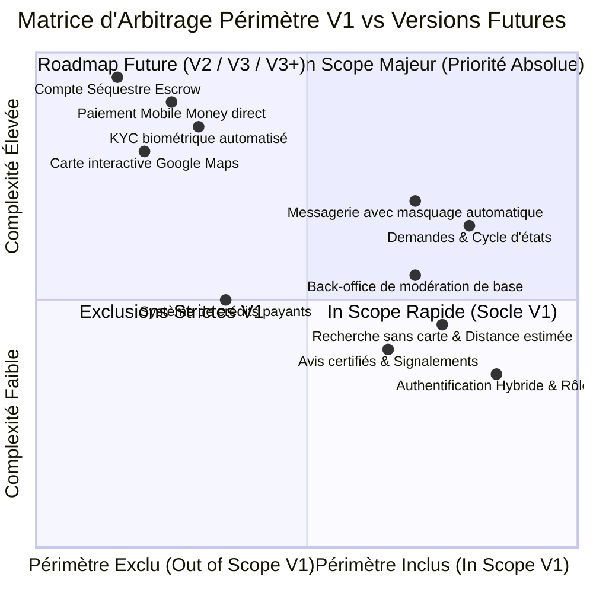
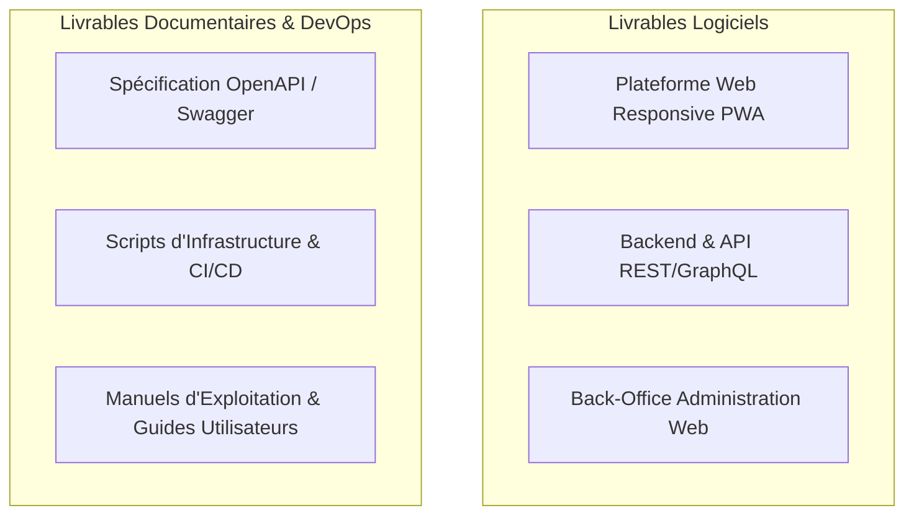
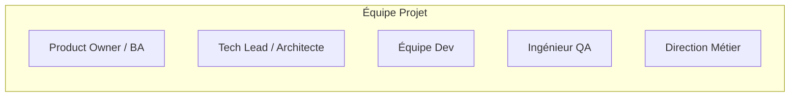

# TERMES DE RÉFÉRENCE (TDR) — PROJET PROXIJOB
## RÉFÉRENTIEL NORMATIF & CAHIER DES CLAUSES TECHNIQUES ET CONTRACTUELLES (CCTC)

---

**Autorité Émettrice :** Direction Produit & Business Analysis PROXIJOB  
**Destinataires Obligatoires :** Tech Lead, Architecte Logiciel, Équipe de Développement, Assurance Qualité (QA), Scrum Master & Partenaires Techniques  
**Statut Contractuel :** VÉRITÉ ABSOLUE DU PROJET (Baseline Immuable de Conformité)  
**Version :** 1.0.0 — Normative Release  
**Date d'Entrée en Vigueur :** Octobre 2026  
**Champ d'Application :** Spécifications, Arbitrages d'Ingénierie, Recette Technique & Métier  

---

## 1. OBJET ET JUSTIFICATION DU PROJET PROXIJOB

### 1.1 Objet du Document
Le présent document de **Termes de Référence (TDR)** constitue le document normatif suprême du projet PROXIJOB. Il fixe de manière inconditionnelle le cadre d'exécution contractuel, les objectifs mesurables, le périmètre strict d'ingénierie (In Scope vs Out of Scope), les critères d'acceptation de recette, les livrables attendus et les pénalités / SLA applicables.
> [!IMPORTANT]
> En cas de divergence ou d'ambiguïté entre une documentation subsidiaire, des comptes rendus de réunions ou du code existant et les présents TDR, **les dispositions du présent document prévalent de plein droit et sans exception.**

### 1.2 Justification Stratégique et Contexte Métier
Le secteur des services de proximité et de l'artisanat en République du Bénin (notamment dans les pôles urbains de Cotonou, Abomey-Calavi et Porto-Novo) souffre d'un déficit structurel d'organisation :
1. **Dispersion de l'offre :** Dépendance au bouche-à-oreille et à des canaux informels volatils (groupes WhatsApp, Facebook, contacts personnels).
2. **Incertitude qualitative :** Absence de mécanisme objectif et indépendant attestant des compétences réelles, du respect des délais et de l'honnêteté des prestataires.
3. **Précarité numérique des artisans (Jobeurs) :** Manque d'outils modernes pour exposer un portfolio vérifiable et conquérir une clientèle qualifiée.

PROXIJOB a été pensé pour formaliser et fluidifier cet écosystème en créant une marketplace bilatérale sécurisée, garantissant la découverte rapide, la pertinence géographique, la transparence des prestations et la confiance mutuelle.

---

## 2. OBJECTIFS GÉNÉRAUX ET SPÉCIFIQUES MESURABLES (SMART)

### 2.1 Objectifs Généraux
* Bâtir et déployer une plateforme logicielle hautement disponible, résiliente et optimisée pour les réseaux mobiles africains.
* Structurer l'offre de services de proximité au Bénin à travers une taxonomie métier claire et évolutive.
* Établir un climat de confiance pérenne grâce à la traçabilité des échanges, la modération proactive et la certification progressive des acteurs.

### 2.2 Objectifs Spécifiques et Indicateurs Clés de Succès (SMART)

| Réf. | Objectif Spécifique | Indicateur de Mesure (KPI) | Cible V1 (Jalon 1) | Échéance |
| :--- | :--- | :--- | :--- | :--- |
| **OBJ-01** | Performance réseau mobile | Temps de chargement initial de la Web App (LCP sur réseau 3G) | $\le 2,5 \text{ secondes}$ | Recette V1 |
| **OBJ-02** | Réactivité de l'API | Latence moyenne sur 95% des requêtes de recherche / consultation | $\le 350 \text{ ms}$ | Recette V1 |
| **OBJ-03** | Efficacité de mise en relation | Taux de demandes de service recevant au moins une réponse sous 24h | $\ge 70\%$ | M+3 post-lancement |
| **OBJ-04** | Intégrité de la plateforme | Taux de faux profils ou annonces frauduleuses résiduelles | $< 1\%$ des comptes actifs | Audit continu |
| **OBJ-05** | Qualité logicielle & Zéro Régression | Couverture de tests automatisés (Unitaires et Intégration métier) | $\ge 80\%$ du code métier | Validation CI/CD |
| **OBJ-06** | Disponibilité opérationnelle | Uptime mesuré du service hors plages de maintenance programmées | $\ge 99,8\%$ | Mensuel |

---

## 3. PÉRIMÈTRE NORMATIF STRICT (IN SCOPE vs OUT OF SCOPE)

Pour éliminer toute dérive de périmètre (*Scope Creep*), la matrice suivante arrête irrévocablement ce qui doit être développé pour la version initiale (V1) et ce qui est formellement ajourné aux versions ultérieures.

### 3.1 Périmètre Strictement IN SCOPE pour la V1 (Socle Marketplace)
1. **Module Gestion des Comptes & Rôles :**
   * Inscription, connexion, déconnexion et réinitialisation de mot de passe (Email/Téléphone format béninois + OTP/Token sécurisé).
   * Gestion du profil Client et du profil Jobeur (Statut Particulier vs Entreprise/Raison sociale).
   * Commutateur de contexte pour les profils Hybrides (Client $\leftrightarrow$ Jobeur) avec session persistante unifiée.
2. **Module Profils & Portfolio :**
   * Présentation des activités, compétences déclarées, description libre, zones d'intervention et créneaux de disponibilité.
   * Portfolio multimédia d'images de réalisations (avec prise en charge du comparateur "Avant / Après").
3. **Module Recherche Intelligente & Proximité :**
   * Moteur de recherche multicritère : métier, service spécifique, ville, quartier.
   * Curseur de rayon de recherche dynamique ajustable par le Client (ex : 2, 5, 10, 25 km).
   * Calcul de distance estimée (algorithme Haversine ou PostGIS) affiché sous forme textuelle.
   * **STRICTEMENT SANS CARTE INTERACTIVE DE TYPE GOOGLE MAPS (Interdiction d'afficher un composant cartographique lourd).**
4. **Module Demandes de Service :**
   * Formulaire structuré de demande avec niveau d'urgence normal vs urgent.
   * Cycle de vie normatif d'états : `Ouverte` $\rightarrow$ `En cours` $\rightarrow$ `Terminée` / `En litige` / `Réouverte` / `Annulée`.
   * Soumission et comparaison des devis / propositions par les Jobeurs.
5. **Module Communication & Messagerie :**
   * Chat instantané intégré associé à chaque demande.
   * **Masquage algorithmique systématique des coordonnées** (numéros de téléphone, emails, liens de contact) avant l'acceptation formelle d'une proposition.
   * Dévoilement automatique des contacts dès acceptation contractuelle de la mission.
6. **Module Confiance & Signalements :**
   * Dépôt d'évaluation (1 à 5 étoiles + critères qualitatifs + commentaire) réservé exclusivement aux Clients ayant finalisé une mission.
   * Système de signalement transversal (profils, contenus, fraudes, litiges).
7. **Module Espace Administration :**
   * Back-office de gestion des utilisateurs, modération des annonces et portfolios, audit des signalements et pilotage des KPI de base.

### 3.2 Périmètre Strictement OUT OF SCOPE pour la V1
* **Composant Cartographique Interactif :** Pas de carte OpenStreetMap, Leaflet ou Google Maps en front-office V1.
* **Paiements en Ligne & Mobile Money :** Aucun flux financier, ni intégration d'API bancaire ou Mobile Money (MTN MoMo, Moov Money, Celtiis Cash) en V1. Tout paiement de prestation s'opère de gré à gré en dehors du système.
* **Séquestre Financier (Escrow) & Portefeuille Virtuel (Wallet) :** Réservés à la version V3+.
* **Facturation des Crédits & Monétisation :** Pas d'encaissement des forfaits ou des crédits en V1 (période d'amorçage et de gratuité régulée).
* **Vérification d'Identité Tiers Automatisée (KYC Biométrique) :** Le badge ProxyTrust et la validation d'identités officielles sont réservés à la V3.
* **Appels Voix / Vidéo WebRTC intégrés :** Exclus de la V1 (messagerie textuelle et images uniquement).

---

## 4. DESCRIPTION CONTRACTUELLE DES LIVRABLES ATTENDUS

Le Tech Lead et son équipe doivent fournir les livrables formels suivants, exempts de tout défaut bloquant ou majeur :

### 4.1 Plateforme Web Responsive & Mobile-First (Front-Office)
* Application Web moderne hautement réactive, optimisée pour navigateurs mobiles (Chrome Mobile, Safari iOS).
* **Directive Impérative "Soft UI & Clean Design" :**
  * Respect rigoureux de la charte chromatique officielle : Bleu Royal Confiance (`#1E40AF` Univers Client), Jaune-Ambre Chaleureux & Soft (`#EAB308` Univers Jobeur, avec texte contrasté accessible `#854D0E`), Blanc Lisibilité (`#FFFFFF`) et surfaces reposantes douces `slate-50` (`#F8FAFC`) / `zinc-50` (`#FAFAFA`).
  * Bordures ultra-fines de 1px en `slate-200` (`#E2E8F0`), ombres portées douces et aériennes (`shadow-soft`), et respiration visuelle généreuse ("soft whitespace") éliminant toute sensation d'étouffement ou d'agressivité visuelle.
* **Expérience Utilisateur Ultra Fluide et Professionnelle :**
  * Parcours sans friction, transitions fluides chronométrées entre 150ms et 200ms avec accélération `ease-out`, micro-interactions douces au toucher (`active:scale-[0.98]`), formulaires aérés et notifications Toast bienveillantes.
* PWA (Progressive Web App) installable sur l'écran d'accueil avec support basique hors-ligne (mise en cache des assets statiques et formulaires tolérants aux déconnexions).

### 4.2 Architecture Backend & API Sécurisée
* API modulaire, découplée, entièrement documentée sous standard **OpenAPI 3.0 (Swagger)**.
* Gestion des rôles RBAC étanche (Client, Jobeur, Hybride, Modérateur, Admin).
* Moteur de calcul spatial léger pour la proximité sans carte.
* Module de messagerie temps réel (WebSockets / SSE) avec moteur de filtrage regex des coordonnées pré-accord.

### 4.3 Back-Office d'Administration & Modération
* Console web dédiée et sécurisée accessible uniquement via réseau/rôle restreint.
* Tableaux de bord de suivi opérationnel, files de modération des portfolios et annonces, console d'investigation des litiges et signalements.

### 4.4 Documentation Technique, Déploiement & Guides
* **Dossier d'Architecture Technique (DAT) :** Schémas de composants, modèle relationnel des données (MCD/MLD), flux de sécurité.
* **Pipeline CI/CD & Infrastructure as Code :** Scripts de déploiement automatisé, conteneurisation Docker, gestion des variables d'environnement étanches.
* **Manuel d'Exploitation & Maintenance :** Procédure de sauvegarde/restauration, monitoring et gestion des incidents.
* **Guides Utilisateurs :** Guide pas-à-pas pour l'onboarding du Jobeur et manuel opératoire des Modérateurs.

---

## 5. CALENDRIER ET JALONS NORMATIFS PAR VERSION

| Jalon | Version Cible | Désignation du Jalon | Fonctionnalités Clés Livrées | Date / Durée Contractuelle |
| :---: | :--- :--- | :--- | :---: |
| **M1** | **V1.0** | **Socle Marketplace (Soft & Clean)** | Inscription hybride (1-clic), recherche de proximité textuelle (**sans carte interactive Maps**), demandes de service, messagerie avec masquage systématique des coordonnées, portfolio photos Avant/Après, avis post-mission, back-office, **paiement cash libre de gré à gré (zéro flux en ligne)** | T0 à T0+3 mois |
| **M2** | **V2.0** | **Engagement & Optimisations** | Plannings de disponibilité temps réel, notes vocales intégrées au chat, filtres granulaires avancés, notifications push | T0+3 à T0+6 mois |
| **M3** | **V2.5** | **Monétisation & Crédits Forfaitaires** | Système de crédits de publication (validité 15j par annonce), Packs commerciaux Jobeurs : Démarrage (500 FCFA / 10 crédits / 24h boost), Visibilité (1 000 FCFA / 20 crédits / 3j boost), Vidéo (2 500 FCFA / 30 crédits / vidéo promo / 7j visibilité). Pass Sans Publicité : 7j (100 FCFA), 30j (300 FCFA), 90j (500 FCFA). Bannières pub et sponsoring de catégories | T0+6 à T0+9 mois |
| **M4** | **V3.0** | **ProxyTrust & Confiance Étatique** | Vérification d'identité locale béninoise (CIP / CNI / IFU), badges officiels certifiés ProxyTrust, surclassement de pertinence, modèles de contrats types, module de médiation | T0+9 à T0+12 mois |
| **M5** | **V3+** | **Transactions Intégrées & Mobile Money** | Passerelles Mobile Money souveraines (MTN MoMo, Moov Money, Celtiis Cash), Portefeuille virtuel (Wallet in-app), Compte Séquestre Financier (Escrow), déblocage post-validation, facturation dématérialisée | T0+12 à T0+16 mois |

---

## 6. MATRICE DE CONFORMITÉ ET CRITÈRES D'ACCEPTATION STRICTS (CHECKLIST D'AUDIT TECH LEAD)

Cette matrice constitue la **grille d'audit binaire (Conforme / Non Conforme)** que le Tech Lead et le Responsable QA doivent exécuter pour valider la livraison du Jalon 1 (V1) :

| Réf. Test | Exigence Auditée | Critère d'Acceptation Strict (DoD - Definition of Done) | Validation |
| :--- | :--- | :--- | :---: |
| **ACC-01** | Inscription & Profil Hybride | L'utilisateur peut s'inscrire avec un téléphone béninois, valider son compte et basculer entre Client et Jobeur en 1 clic sans déconnexion. | [ ] REÇU |
| **ACC-02** | Absence Totale de Carte en V1 | Aucune ressource de carte interactive (Google Maps, Leaflet, Mapbox) n'est chargée dans le DOM client sur les pages de recherche. | [ ] REÇU |
| **ACC-03** | Calcul de Distance Estimée | La recherche affiche une distance approximative textuelle cohérente basée sur les coordonnées ou barycentres des quartiers déclarés. | [ ] REÇU |
| **ACC-04** | Rayon de Recherche Ajustable | Le client peut modifier le rayon via un slider ou sélecteur (2, 5, 10, 25 km) et la liste des Jobeurs se filtre instantanément. | [ ] REÇU |
| **ACC-05** | Cycle de Vie de la Demande | La demande transite sans anomalie d'état : `Ouverte` $\rightarrow$ `En cours` $\rightarrow$ `Terminée`. L'état `Terminée` débloque l'avis. | [ ] REÇU |
| **ACC-06** | Masquage des Coordonnées Chat | Toute chaîne ressemblant à un numéro de téléphone béninois (+229, 8/10 chiffres), email ou lien wa.me est masquée par des astérisques tant que le devis n'est pas accepté. | [ ] REÇU |
| **ACC-07** | Déblocage des Coordonnées | Dès l'acceptation formelle de la proposition par le Client, les coordonnées complètes sont automatiquement rendues lisibles. | [ ] REÇU |
| **ACC-08** | Verrouillage des Avis Non Éligibles | Un utilisateur n'ayant pas réalisé et terminé une demande avec un Jobeur reçoit une erreur 403 lorsqu'il tente de soumettre un avis sur ce Jobeur. | [ ] REÇU |
| **ACC-09** | Portfolio "Avant / Après" | Le Jobeur peut uploader 2 images associées à une réalisation, restituées sous un comparateur visuel ergonomique. | [ ] REÇU |
| **ACC-10** | Modération Back-Office | L'administrateur peut suspendre un profil, masquer une image de portfolio non conforme et arbitrer un signalement depuis sa console. | [ ] REÇU |
| **ACC-11** | Budget de Performance Mobile | Le poids du bundle initial transféré en production est $\le 1,5\text{ Mo}$ et le temps d'exécution JS sur mobile moyen reste sous 1 seconde. | [ ] REÇU |
| **ACC-12** | Sécurité des Sessions & RBAC | Une tentative d'accès à un endpoint modérateur avec un jeton Client/Jobeur renvoie un code HTTP 403 Forbidden immédiat. | [ ] REÇU |
| **ACC-13** | Conformité Soft UI & Clean Design | L'interface applique strictement la palette Bleu `#1E40AF` / Jaune-Ambre `#EAB308` / Blanc, des surfaces douces `slate-50`, des ombres diffuses `shadow-soft` et une aération visuelle généreuse ("soft whitespace"). | [ ] REÇU |
| **ACC-14** | Fluidité UX & Transitions Réactives | Les micro-interactions et transitions interactives s'exécutent avec une fluidité de 150-200ms `ease-out`, avec retour tactile doux sans saccade ni blocage. | [ ] REÇU |

---

## 7. DISPOSITIF DE GOUVERNANCE, RÔLES ET GESTION DES RISQUES

### 7.1 Matrice RACI du Projet

| Rôle / Entité | Product Owner / BA | Tech Lead / Architecte | Développeurs | Responsable QA | Direction Métier |
| :--- | :---: | :---: | :---: | :---: | :---: |
| **Définition du Besoin & TDR** | **A / R** | C | I | C | **A** |
| **Architecture & Choix Techniques** | C | **A / R** | C | I | I |
| **Développement du Code** | I | A | **R** | I | I |
| **Recette de Conformité TDR** | **R** | C | I | **A / R** | C |
| **Mise en Production** | C | **A / R** | R | C | **A** |

*Légende :* **R** = Responsable de l'action (*Responsible*), **A** = Décideur / Approbateur (*Accountable*), **C** = Consulté (*Consulted*), **I** = Informé (*Informed*).

### 7.2 Registre des Risques Majeurs et Plans de Mitigation

| Réf. | Risque Identifié | Impact | Proba | Stratégie de Mitigation Contractuelle |
| :--- | :--- | :---: | :---: | :--- |
| **RSK-01** | **Contournement de la messagerie :** Échange précoce de contacts pour négocier hors plateforme. | Élevé | Élevée | Masquage algorithmique natif strict dans le chat avant acceptation formelle ; messages de sensibilisation in-app. |
| **RSK-02** | **Données géographiques floues :** Adressage imprécis des rues à Cotonou/Calavi. | Moyen | Élevée | Référentiel normalisé de communes et quartiers, complété par un champ textuel de repère visuel (ex : *"Face pharmacie X"*). |
| **RSK-03** | **Volatilité de la connectivité :** Ruptures réseau mobile fréquentes chez l'artisan. | Élevé | Élevée | Architecture PWA avec stockage local hors-ligne (IndexedDB/CacheStorage) et synchronisation dès reconnexion. |
| **RSK-04** | **Faux avis / Attaques réputationnelles :** Évaluations abusives entre concurrents. | Élevé | Moyen | Verrouillage cryptographique : avis exclusivement lié à une commande terminée ; droit de réponse encadré et audit IP. |

---

## 8. NORMES DE QUALITÉ ET SERVICE LEVEL AGREEMENTS (SLA) DE RECETTE

### 8.1 Niveaux de Gravité des Anomalies (Defect Severity)
Lors des campagnes de qualification et de recette d'usine :
1. **Bloquante (G0) :** Impossibilité totale d'exécuter un parcours utilisateur critique (inscription, recherche, soumission de demande, acceptation de devis). *Délai de résolution contractuel : $\le 8\text{ heures ouvrées}$.*
2. **Majeure (G1) :** Fonctionnalité clé dégradée sans contournement acceptable (ex : échec du masquage des numéros de téléphone, calcul erroné de la distance estimée). *Délai de résolution contractuel : $\le 24\text{ heures ouvrées}$.*
3. **Mineure (G2) :** Défaut ergonomique, coquille textuelle, décalage graphique mineur n'empêchant pas l'usage. *Délai de résolution contractuel : Prochaine itération de sprint.*

### 8.2 Critères Inconditionnels de Clôture de Recette (Go / No-Go)
Le déploiement en production de chaque version (et spécifiquement du Jalon 1 - V1) est subordonné à la validation conjointe du Product Owner et du Tech Lead sur la base des critères suivants :
* **0 Anomalie de sévérité G0 (Bloquante)** en suspens ;
* **0 Anomalie de sévérité G1 (Majeure)** en suspens ;
* **Taux de conformité sur la Checklist d'Audit (§ 6) égal à 100%** ;
* Rapport de scan de vulnérabilités applicatives (SAST/DAST) certifiant l'absence de faille critique OWASP.

---

## 9. MATRICE NORMATIVE DE TRAÇABILITÉ & COUVERTURE DES 18 SECTIONS DU CADRAGE PROXIJOB

En tant qu'autorité normative suprême et **VÉRITÉ ABSOLUE du projet**, les présents TDR certifient la prise en charge inconditionnelle, l'encadrement technique et la vérifiabilité des 18 sections du document officiel de cadrage PROXIJOB :

| Section Cadrage | Objet & Intitulé Officiel | Disposition Normative Contractuelle TDR | Réf. DoD / Critère d'Acceptation | Statut de Conformité |
| :---: | :--- | :--- | :--- | :---: |
| **Section 1** | Identité et vision du projet | Marketplace locale bilatérale de confiance au Bénin (Cotonou, Calavi, Porto-Novo) | TDR § 1.1, § 1.2 | **CERTIFIÉ CONFORME** |
| **Section 2** | Utilisateurs et cibles | Gestion des rôles Client, Jobeur et Compte Hybride sans déconnexion | ACC-01, TDR § 3.1 (1) | **CERTIFIÉ CONFORME** |
| **Section 3** | Fonctionnement de ProxiJob | Recherche textuelle avec proximité calculée, **interdiction formelle de carte Google Maps en V1** | ACC-02, ACC-03, ACC-04 | **CERTIFIÉ CONFORME** |
| **Section 4** | Profils et comptes | Profils enrichis, statuts Particulier/Entreprise, portfolio photos comparateur Avant/Après | ACC-09, TDR § 3.1 (2) | **CERTIFIÉ CONFORME** |
| **Section 5** | Demandes et missions | Workflow des demandes, messagerie temps réel avec **masquage automatique regex des coordonnées** | ACC-05, ACC-06, ACC-07 | **CERTIFIÉ CONFORME** |
| **Section 6** | Navigation et expérience | Carnet de favoris, historique persistant d'activité, UX mobile-first à une main | TDR § 3.1 (6), § 4.1 | **CERTIFIÉ CONFORME** |
| **Section 7** | Confiance, réputation et sécurité | Avis verrouillés post-prestation uniquement, signalements, préfiguration ProxyTrust V3 | ACC-08, RSK-04, TDR § 3.1 (6) | **CERTIFIÉ CONFORME** |
| **Section 8** | Espace administration | Console de modération des contenus, gestion des profils et audit des signalements | ACC-10, ACC-12, TDR § 4.3 | **CERTIFIÉ CONFORME** |
| **Section 9** | Modèle économique et tarification | Gratuité V1, crédits de publication 15j, packs commerciaux (500, 1000, 2500F), pass sans pub (100, 300, 500F) | TDR § 5 (Jalon M3), § 3.2 | **CERTIFIÉ CONFORME** |
| **Section 10** | Paiements et transactions | V1 cash libre hors plateforme. V3+ Mobile Money MTN/Moov/Celtiis et séquestre Escrow | TDR § 3.2 (Exclusion V1), § 5 | **CERTIFIÉ CONFORME** |
| **Section 11** | Design et expérience utilisateur | Directive Soft UI & Clean Design, palette Bleu `#1E40AF` / Jaune `#EAB308` / Blanc, transitions 150-200ms | ACC-13, ACC-14, TDR § 4.1 | **CERTIFIÉ CONFORME** |
| **Section 12** | Acquisition et lancement | Déploiement concentré Cotonou puis Calavi/Porto-Novo, onboarding terrain artisans, parrainage | TDR § 1.2, RACI § 7.1 | **CERTIFIÉ CONFORME** |
| **Section 13** | Technologie et architecture | Architecture découplée PWA Next.js, API REST OpenAPI 3.0, PostgreSQL, résilience Low-Data | ACC-11, TDR § 4.2 | **CERTIFIÉ CONFORME** |
| **Section 14** | Versions du produit | Respect strict des jalons M1 (V1), M2 (V2), M3 (V2.5), M4 (V3), M5 (V3+) | TDR § 5 (Tableau des Jalons) | **CERTIFIÉ CONFORME** |
| **Section 15** | Données, confidentialité & gouvernance| Conformité Code du Numérique Bénin / APDP, chiffrement des données, rétention 2 ans | TDR § 3.1, § 7.2 (RSK-01) | **CERTIFIÉ CONFORME** |
| **Section 16** | Indicateurs de performance | Suivi SMART des KPI Clients, Jobeurs et Plateforme (conversion, latence, satisfaction) | TDR § 2.2 (Tableau SMART) | **CERTIFIÉ CONFORME** |
| **Section 17** | Maintenance et évolution | Maintenance corrective sous SLA 8h/24h, sauvegardes quotidiennes, support WhatsApp | TDR § 4.4, § 8.1 & § 8.2 | **CERTIFIÉ CONFORME** |
| **Section 18** | Priorités générales du projet | 5 priorités : Mise en relation, Offre de qualité, Confiance, Expérience Soft & Pro, Monétisation progressive | TDR § 1.1, § 2.1, § 3 | **CERTIFIÉ CONFORME** |

---
*Document certifié conforme au cadrage officiel PROXIJOB — Termes de Référence applicables sans réserve (VÉRITÉ ABSOLUE DU PROJET).*
